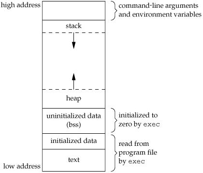
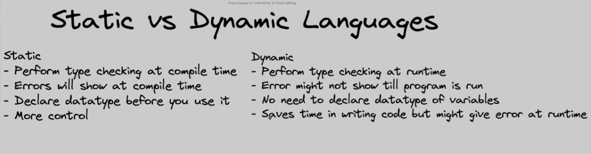
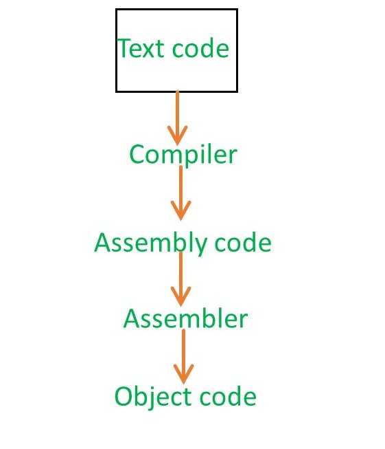

- [Memory Allocation in C](#memory-allocation-in-c)
  - [1. Text / Code Segment](#1-text--code-segment)
  - [2. Initialized Data Segment](#2-initialized-data-segment)
  - [3. Uninitialized Data Segment / BSS](#3-uninitialized-data-segment--bss)
  - [4. Heap](#4-heap)
  - [5. Stack](#5-stack)
    - [What is Stack Overflow Error?](#what-is-stack-overflow-error)
  - [6. Command Line Arguments](#6-command-line-arguments)
  - [7. Usage of Heap](#7-usage-of-heap)
  - [Static vs. Dynamic Languages](#static-vs-dynamic-languages)
- [Source Code to Executable File](#source-code-to-executable-file)
  - [Source Code to Assembly Code](#source-code-to-assembly-code)
  - [Assembly Code to Object/Intermediate Code](#assembly-code-to-objectintermediate-code)
    - [What is Object/Intermediate Code?](#what-is-objectintermediate-code)
  - [`gcc` compiler](#gcc-compiler)
  - [Intermediate/Object Code files](#intermediateobject-code-files)
  - [Role of Linker in creating executable/library files](#role-of-linker-in-creating-executablelibrary-files)
    - [How exactly does `linker` work and what is its need?](#how-exactly-does-linker-work-and-what-is-its-need)
    - [Static vs. Dynamic Linking](#static-vs-dynamic-linking)
      - [Static Linking](#static-linking)
      - [Dynamic Linking](#dynamic-linking)
  - [Does C have a runtime environment, like Java has JVM?](#does-c-have-a-runtime-environment-like-java-has-jvm)
    - [1. Compilation](#1-compilation)
    - [2. Linking (Runtime Libraries used)](#2-linking-runtime-libraries-used)
    - [3. Execution](#3-execution)
- [Sequence Points in C/C++](#sequence-points-in-cc)
- [Variables in C/C++](#variables-in-cc)
  - [`lvalue` and `rvalue`](#lvalue-and-rvalue)
  - [Different ways of declaring variables](#different-ways-of-declaring-variables)
  - [Initializing Variables](#initializing-variables)
  - [Dynamic Initialization](#dynamic-initialization)
  - [Redefining vs. Redeclaring variables](#redefining-vs-redeclaring-variables)
- [Data in C++](#data-in-c)
  - [Fundamental Data Types](#fundamental-data-types)
  - [Data Type Modifiers](#data-type-modifiers)
    - [Integer Type Modifiers](#integer-type-modifiers)
    - [Character Type Modifiers](#character-type-modifiers)
    - [Floating-point Type Modifiers](#floating-point-type-modifiers)
  - [Scalar vs. Non-scalar data objects](#scalar-vs-non-scalar-data-objects)
  - [Floating-point suffixes](#floating-point-suffixes)
  - [Type Promotion](#type-promotion)
  - [Narrowing Type Conversions](#narrowing-type-conversions)
    - [`{}`-initializer syntax to prevent type-narrowing](#-initializer-syntax-to-prevent-type-narrowing)
  - [Derived Data Types](#derived-data-types)
    - [Functions](#functions)
    - [Arrays](#arrays)
    - [Pointers](#pointers)
      - [Base typing and pointing by a pointer](#base-typing-and-pointing-by-a-pointer)
    - [References](#references)
      - [Memory in the context of References](#memory-in-the-context-of-references)
    - [Constants (`const` Access Modifier)](#constants-const-access-modifier)
      - [`const` keyword as an access modifier](#const-keyword-as-an-access-modifier)
      - [How to initialize `const` variables using user-input OR by programmatical output](#how-to-initialize-const-variables-using-user-input-or-by-programmatical-output)
      - [`const` variables vs. `const` return types](#const-variables-vs-const-return-types)
  - [Sizes in Array Declarations](#sizes-in-array-declarations)
- [Scopes](#scopes)
  - [Scopes in C++](#scopes-in-c)
    - [Local Scope](#local-scope)
    - [Function Scope](#function-scope)
    - [File Scope](#file-scope)
    - [Class Scope (TODO)](#class-scope-todo)
  - [Function Scope Determination](#function-scope-determination)
    - [Local function prototype](#local-function-prototype)
    - [Global function prototype](#global-function-prototype)
  - [Variables Scope Determination](#variables-scope-determination)
    - [Global variables](#global-variables)
    - [Local variables](#local-variables)
    - [Static Local variables](#static-local-variables)
- [I/O in C \& C++ (TODO)](#io-in-c--c-todo)
  - [printf and scanf](#printf-and-scanf)
    - [Format Specifiers](#format-specifiers)
    - [More details about `scanf()`](#more-details-about-scanf)
    - [Taking input of two variables together](#taking-input-of-two-variables-together)
  - [`puts()` function](#puts-function)
  - [Basic elements for I/O in C++](#basic-elements-for-io-in-c)
  - [Cascading of I/O operators (`<<` and `>>`)](#cascading-of-io-operators--and-)
  - [get() 'single-character' function for input](#get-single-character-function-for-input)
  - [`cin >> ch` vs. `cin.get(ch)`](#cin--ch-vs-cingetch)
- [Some commonly used operators](#some-commonly-used-operators)
  - [Address-of/Reference (`&`) operator](#address-ofreference--operator)
  - [`sizeof()` operator](#sizeof-operator)
- [Pointers in C](#pointers-in-c)
  - [What are Pointers?](#what-are-pointers)
  - [Dereference Operator (`*`)](#dereference-operator-)
  - [Dereference (`*`) AND Reference (`&`) operators are converse of each other](#dereference--and-reference--operators-are-converse-of-each-other)
  - [What is the type of a pointer variable?](#what-is-the-type-of-a-pointer-variable)
  - [Why do we have to define a type for just pointing to an address? Aren't all addresses the same?](#why-do-we-have-to-define-a-type-for-just-pointing-to-an-address-arent-all-addresses-the-same)
  - [(Pointer initialization) Vs. (Pointer declaration \& assignment)](#pointer-initialization-vs-pointer-declaration--assignment)
    - [Initializing a Pointer with a value](#initializing-a-pointer-with-a-value)
    - [When we declare a pointer and assign a value to it later](#when-we-declare-a-pointer-and-assign-a-value-to-it-later)
  - [Using pointers in looping statements](#using-pointers-in-looping-statements)
    - [Pointer as LOOP VARIABLE of a WHILE loop](#pointer-as-loop-variable-of-a-while-loop)
    - [Pointer as LOOP VARIABLE of a FOR loop](#pointer-as-loop-variable-of-a-for-loop)
  - [Pointer to Pointer](#pointer-to-pointer)
  - [Pointers To Multidimensional Arrays](#pointers-to-multidimensional-arrays)
    - [Syntax for declaring a pointer to 2-D array](#syntax-for-declaring-a-pointer-to-2-d-array)
    - [INCORRECT syntax 1](#incorrect-syntax-1)
    - [INCORRECT syntax 2](#incorrect-syntax-2)
    - [Using Multi-dimensional array pointers](#using-multi-dimensional-array-pointers)
  - [`void*` pointers](#void-pointers)
  - [What are they?](#what-are-they)
  - [Pointer arithmetic on `void*` pointers](#pointer-arithmetic-on-void-pointers)
- [Arrays in C](#arrays-in-c)
  - [Incrementing pointers pointing to array elements](#incrementing-pointers-pointing-to-array-elements)
  - [Decaying of array names to pointers](#decaying-of-array-names-to-pointers)
    - [Array name as argument of `&` operator](#array-name-as-argument-of--operator)
  - [Calculating the length of an array using pointers](#calculating-the-length-of-an-array-using-pointers)
  - [2-D Arrays](#2-d-arrays)
    - [Declaring 2-D Arrays](#declaring-2-d-arrays)
    - [Memory Allocation of 2-D Arrays.](#memory-allocation-of-2-d-arrays)
      - [Testing this theory..](#testing-this-theory)
- [Compiling using g++](#compiling-using-g)
  - [Options controlling the kind of Output](#options-controlling-the-kind-of-output)
  - [Operands accepted by `gcc` or `g++`](#operands-accepted-by-gcc-or-g)
  - [Compiling a CPP file to generate an executable target file](#compiling-a-cpp-file-to-generate-an-executable-target-file)
    - [`g++ file_name`](#g-file_name)
    - [`g++ -S file_name`](#g--s-file_name)
    - [`g++ -c file_name`](#g--c-file_name)
    - [`g++ -o target_name file_name`](#g--o-target_name-file_name)
  - [Compiling and linking multiple files](#compiling-and-linking-multiple-files)
    - [Printing compilation warning messages (`g++ -Wall file_name`)](#printing-compilation-warning-messages-g--wall-file_name)
- [Header files and Namespaces](#header-files-and-namespaces)
  - [Accessing methods using **header files** and **namespaces**](#accessing-methods-using-header-files-and-namespaces)
  - [Need of both **Header files** and **namespaces**](#need-of-both-header-files-and-namespaces)
    - [What are Header Files?](#what-are-header-files)
      - [How do they work?](#how-do-they-work)
    - [What is a Namespace?](#what-is-a-namespace)
  - [How does the most elementary combination of `<iostream>` header file and `std` namespace work?](#how-does-the-most-elementary-combination-of-iostream-header-file-and-std-namespace-work)
- [Scopes in C++](#scopes-in-c-1)
- [Dynamic Memory Allocation in C++](#dynamic-memory-allocation-in-c)
  - [`new` operator](#new-operator)
  - [`delete` \& `delete[]` operator](#delete--delete-operator)
    - [Examples](#examples)
  - [Example containing usage of `new` and `delete`](#example-containing-usage-of-new-and-delete)
- [OOP in C++](#oop-in-c)
  - [Introduction](#introduction)
  - [Member Functions of Classes (Implicitly Inline)](#member-functions-of-classes-implicitly-inline)
  - [Access Modifiers](#access-modifiers)
  - [Friend Class](#friend-class)
    - [Important points about friendship](#important-points-about-friendship)
    - [Example code-snippet](#example-code-snippet)
  - [Friend Function](#friend-function)
  - [Late binding OR Runtime Polymorphism](#late-binding-or-runtime-polymorphism)
    - [How it works in C++, step-by-step](#how-it-works-in-c-step-by-step)
      - [1. Class Hierarchy Definition](#1-class-hierarchy-definition)
      - [2. Compilation](#2-compilation)
      - [3. Linking](#3-linking)
      - [4. Runtime](#4-runtime)
    - [Scenarios where late binding is used](#scenarios-where-late-binding-is-used)
      - [1. Run-Time Polymorphism](#1-run-time-polymorphism)
      - [2. Abstract Base Classes and Interfaces](#2-abstract-base-classes-and-interfaces)
      - [3. Runtime Decisions](#3-runtime-decisions)
- [Templates in C++](#templates-in-c)
  - [Declaring one or more Template Parameters using PlaceHolder Types](#declaring-one-or-more-template-parameters-using-placeholder-types)
  - [Templates with Default Parameters](#templates-with-default-parameters)
  - [Class Templates](#class-templates)
  - [Function Templates](#function-templates)
  - [Difference between `typename` and `class` keyword](#difference-between-typename-and-class-keyword)
- [Standard Template Library in C++](#standard-template-library-in-c)
  - [Advantages of STL](#advantages-of-stl)
  - [Containers](#containers)
    - [Sequence Containers](#sequence-containers)
    - [`std::vector`](#stdvector)
    - [Some member functions of `std::vector`](#some-member-functions-of-stdvector)
      - [Take a look at vectors.cpp for example code.](#take-a-look-at-vectorscpp-for-example-code)
    - [`std::list`](#stdlist)
    - [Associative Containers](#associative-containers)
    - [`std::set` and `std::multiset`](#stdset-and-stdmultiset)
    - [`std::map` and `std::multimap`](#stdmap-and-stdmultimap)
    - [Derived Containers](#derived-containers)
  - [Iterators](#iterators)
- [Overloading the Stream Insertion (`<<`) and Stream Extraction (`>>`) operator](#overloading-the-stream-insertion--and-stream-extraction--operator)
  - [`ostream` class](#ostream-class)
    - [`ofstream` class (derived from `ostream` class)](#ofstream-class-derived-from-ostream-class)
  - [`istream` class](#istream-class)
    - [`ifstream` class (derived from `istream` class)](#ifstream-class-derived-from-istream-class)
  - [`cin` and `cout`](#cin-and-cout)
  - [Stream Insertion and Extraction operators](#stream-insertion-and-extraction-operators)
    - [Stream Insertion Operator (`<<`)](#stream-insertion-operator-)
  - [Original Function Signature of iostream operator functions](#original-function-signature-of-iostream-operator-functions)
  - [Return type of the overloaded Operator Function](#return-type-of-the-overloaded-operator-function)
- [Important Concepts](#important-concepts)
  - [Functors in C++](#functors-in-c)
    - [Code snippet demonstrating its usage with STL](#code-snippet-demonstrating-its-usage-with-stl)
  - [Name Lookup vs. Overload Resolution](#name-lookup-vs-overload-resolution)
    - [What is Overload Resolution?](#what-is-overload-resolution)
    - [What is Name Lookup?](#what-is-name-lookup)
    - [Coming to the important part mentioned in Clause 6.5.1...](#coming-to-the-important-part-mentioned-in-clause-651)
    - [Example code-snippet (Example of why multiple inheritance is bad)](#example-code-snippet-example-of-why-multiple-inheritance-is-bad)
  - [Type Promotion and Type Narrowing](#type-promotion-and-type-narrowing)
  - [Poor Performance due to `std::endl`](#poor-performance-due-to-stdendl)
    - [Why aren't characters immediately written?](#why-arent-characters-immediately-written)
    - [Is there need to explicitly flush a stream?](#is-there-need-to-explicitly-flush-a-stream)
  - [Zero Initializing vs. Default Initializing vs. Value Initializing](#zero-initializing-vs-default-initializing-vs-value-initializing)
  - [Function Scope Determination](#function-scope-determination-1)
  - [Pass and Return by Reference in C++](#pass-and-return-by-reference-in-c)
    - [What is actually the meaning of By Reference?](#what-is-actually-the-meaning-of-by-reference)
    - [Makeshift Pass and Return by Reference of C](#makeshift-pass-and-return-by-reference-of-c)
    - [Example scripts of Pass and Return by Reference in C++](#example-scripts-of-pass-and-return-by-reference-in-c)
  - [Data types in Switch Case statement](#data-types-in-switch-case-statement)
  - [Size of Classes/Structures in C++](#size-of-classesstructures-in-c)
    - [Size of an Empty Class](#size-of-an-empty-class)
    - [Amount of Memory occupied by a Derived Class Object](#amount-of-memory-occupied-by-a-derived-class-object)
  - [Empty Function/Constructor Definition](#empty-functionconstructor-definition)
  - [How does a C++ program end ( return value of `int main()` )](#how-does-a-c-program-end--return-value-of-int-main-)
    - [Can we use `void main()` in C? Should we use it?](#can-we-use-void-main-in-c-should-we-use-it)
  - [Difference b/w Argument \& Parameter](#difference-bw-argument--parameter)
  - [Lvalues \& Rvalues](#lvalues--rvalues)
- [Common Errors in C/C++ Code](#common-errors-in-cc-code)
  - [Code Snippet 1](#code-snippet-1)
- [Tips for C++](#tips-for-c)
  - [Alternative to `for-else` and `while-else` in C++](#alternative-to-for-else-and-while-else-in-c)
  
<!-- /TOC -->


# Memory Allocation in C

Memory assigned to a program in a typical architecture can be broken down into four segments:
A typical memory representation of a C program consists of the following sections.
1. Text/Code segment  (i.e. instructions)
2. Initialized data segment 
3. Uninitialized data segment  (bss)
4. Heap 
5. Stack
6. Command Line Arguments
   
A typical memory layout of a running process



## 1. Text / Code Segment 

Text / Code segment is one of the sections of a program in an object file or in memory, which contains executable instructions.

We can understand this with the help of an example:

When we compile a program a BINARY file containing **Intermediate Code** gets generated. Suppose we generate a.out for a hello world C-program. a.out consists of the instructions and these instructions are stored in the text segment. 

As a memory region, a text segment may be placed below the heap or stack in order to prevent heaps and stack overflows from overwriting it. In addition to that, it is read-only. 

Usually, the text segment is sharable so that only a single copy needs to be in memory for frequently executed programs, such as text editors, the C compiler, the shells, and so on. Also, the text segment is often read-only, to prevent a program from accidentally modifying its instructions.

## 2. Initialized Data Segment 

Initialized data segment, usually called simply the **Data Segment**. A data segment is a portion of the virtual address space of a program, which contains the global variables and static variables that are initialized by the programmer.
Note that, the data segment is not read-only, since the values of the variables can be altered at run time.
This segment can be further classified into the initialized read-only area and the initialized read-write area.

For instance, the global string defined by 
`char s[] = “hello world”` in C and a C statement like `int debug=1` outside the main (i.e. global) would be stored in the initialized read-write area. 

And a global C statement like `const char* string = “hello world”` makes the string literal `“hello world”` to be stored in the initialized read-only area and the character pointer variable string in the initialized read-write area.

Ex: `static int i = 10` will be stored in the data segment and `global int i = 10` will also be stored in data segment

## 3. Uninitialized Data Segment / BSS

Uninitialized data segment often called the `bss` segment, named after an ancient assembler operator that stood for “block started by symbol.” 

It starts at the end of the [initialized data segment](#2-initialized-data-segment).

Every member of this segment is initialized by the kernel to arithmetic 0 before the program starts executing

It contains all `global` and `static` variables that are initialized to zero or do not have EXPLICIT INTIALIZATION in source code.

For instance, 

- a variable declared `static int i`
- a global variable declared `int j`
 
both, would be contained in the BSS segment.

## 4. Heap

Heap is the segment where dynamic memory allocation usually takes place.

The heap area begins at the end of the BSS segment and grows to larger addresses from there. 

Using `malloc` and `calloc` we can allocate memory in heap.

The Heap area is shared by all shared libraries and dynamically loaded modules in a process.

Checkout the [usage of heap](#7-usage-of-heap) below.

## 5. Stack

The process Stack contains TEMPORARY data such as:

- used to store all `local variables`.
- used for passing `parameters` to the methods/functions along with storing the `return address` of the **instruction**. This instruction is returned to the appropriate `return address` after the function call is over.
- used for storing [automatic variables](#what-are-automatic-variables). 
  
    ### What are Automatic Variables??

    Automatic variables are local variables that allocate memory automatically upon entry to that block and free the occupied memory upon exit from that block.

    In C/C++, all variables declared within a block of code are `automatic` by default. An uninitialized automatic variable has an undefined value until it is assigned a valid value of its type.

It is called the **Stack** segment since it has the Last-In-First-Out (LIFO) structure.


The stack area is traditionally adjoined with the heap area and grows in the opposite direction. When the stack pointer meets the heap pointer, free memory was exhausted. (With modern large address spaces and virtual memory techniques they may be placed almost anywhere, but they still typically grow in opposite directions.)

Each time a function is called, a `stack frame` is pushed onto the stack. It is effectively, a segregated section on the stack. It consists at the least, a return address and certain information about the caller's environment. 

The newly called function then allocates room within the `stack frame` for its automatic and other local variables. 

This is the premise of the working of recursive functions in C. Each time a recursive function calls itself, a new stack frame is pushed, so that one set of variables doesn’t interfere with the variables from another instance of the function. 

As the variables are popped out of the stack frame once their scope is over, at the bottom of the stack frame is the `return address`, which is the last operation completed before the stack frame is removed because the function call ends with a return operation.

### What is Stack Overflow Error?

The compiler allocates some space for the stack part of the memory. When this space gets exhausted due to some faulty code, the situation is called **stack overflow**.
Typical example includes recursion with wrong/no base condition.

## 6. Command Line Arguments

Command line arguments like `argc` and `argv`, and environment variables are stored in this memory.

## 7. Usage of Heap

We can create a pointer/reference variable in our `main` function and point to a memory block in the HEAP. 
The address is stored by the reference variable local to the `main` function (this local variable is stored in Stack segment in the `stack frame` of the `main` function). 

The value the reference variable points to in HEAP is known as the 'Object'. Note that multiple reference variables can point to the same object. 
```c
int main() {
  int a = 10;
  int b = 10;
}
```
`a` and `b` are both **reference variables** that point to the **object** `10`.

Also, in the case of [dynamic languages](#static-vs-dynamic-languages), the same reference variable can be made to point to an object of another data-type, which would also be stored in the heap memory.

We should note that the memory consumed will not get freed automatically in case we overwrite/destroy the pointer. 

If suppose we overwrite the pointer to an array with a character, the remaining memory which was occupied by the array will become GARBAGE and it will be counted in the usage of the program.

OR

If we delete the pointer/reference variable, the object will still consume memory in heap as GARBAGE.

This should be looked out for as it can lead to complete exhaustion of the memory.

In the case of languages like Java, which have the facility of GARBAGE collection, those **objects** which don't have any **reference variable** pointing to them are removed from memory.

## Static vs. Dynamic Languages



# Source Code to Executable File

## Source Code to Assembly Code

When we have the source code of a C program, that `source code` is passed to the compiler and compiler will produce the output in `assembly code` (mnemonic version of machine code). 

## Assembly Code to Object/Intermediate Code

This assembly language code is given to the assembler and assembler produces ***Object Code***,  which is usually in binary language.  

### What is Object/Intermediate Code?

The term ***Object Code*** indicates the code is the goal or **"objective"** of the compiling process, wherein compilation includes the assembling phases as well.

This code can be run on any machine with the same CPU architecture. It is also referred to as ***Intermediate Code***. Intermediate code lies between the high-level language and the machine language. 

If the compiler directly translated source code into machine code, without generating intermediate code then a fully native compiler would be required for each new machine.

Let us take an example to understand this.

Suppose we have a file called `example.cpp`. When we compile this file using the compiler, an executable file containing intermediate code of BINARY FILE FORMAT is created. 

Upon running this newly created executable file, we get the output of our program. It can be run independent of the presence of the source code.

## `gcc` compiler

When we wish to run a C program, we just pass it to the `gcc` compiler and it directly gives us the executable file for the program. 

But, we know that there are several steps along with compilation for obtaining the executable file for a program.

The compiler software actually has within it, the `assembler` along with `loader` and `linker`. So, all the modules are kept together. 

When we call `gcc`, we are actually calling not just the `compiler`, we are calling the `compiler`, then `assembler`, then `linker` and `loader`.

## Intermediate/Object Code files

`.obj` files (.o files on Linux/Unix) are ***compiled & assembled*** source files. 

There will indeed be one for each `.cpp` file, or more formally "compilation unit". 

They are produced by the ***compilation & assembling*** phase of building a project.

<div align="center" >

</div>

## Role of Linker in creating executable/library files

These `.obj` files are then combined by linker to:
 - an application, which is usually a `.exe` file on Windows. On Unix-like systems, an application has no extension. 
 
    OR
 - a library file (dynamic or static)
    -  `.dll` *(Dynamic-Link Library)* on Windows, `.so` on a Unix-like platform for dynamic library files.
    - `.lib` on Windows, `.a` on a Unix-like platform for static library files (which is basically a collection of `.obj` files in one packed into one file). 

We do not see `.obj` files or static `.lib` files with applications/programs, because they are not needed at runtime, they are used only by `linker`. 

When we run the linking phase of building a project, `linker` combines all the needed `.obj` files into `.exe` and `.dll` files (or equivalent), which are used at runtime.

### How exactly does `linker` work and what is its need?

Let us assume that we `#include`'d some header files in our C program and used the functions that had their prototypes within these header files.

We know that the actual definitions of these functions are in certain libraries that are referred to within the header file.

If we were to explain the need of a linker in simple terms, after ***compilation & assembling***, once we obtain the object code contained within an `.obj` file, the linker ensures that the definitions of the **library functions** used are grouped with the object code into a single package which is the **executable file** of the program.

### Static vs. Dynamic Linking

#### Static Linking
  
When we click the `.exe` (executable) file of the program and it starts running, all the necessary contents of the binary file have been loaded into the process’s virtual address space. However, most programs also need to run functions from the system libraries, and these library functions also need to be loaded.

In the simplest case, the necessary library functions are embedded directly in the program’s executable binary file. Such a program is statically linked to its libraries, and statically linked executable codes can commence running as soon as they are loaded.

- **Advantage:**

  The executable would still run even if the library whose functions are being used gets uninstalled.

- **Disadvantage:**

  Every program generated must contain copies of exactly the same common system library functions. In terms of both physical memory and disk-space usage, it is much more efficient to load the system libraries into memory only once. Dynamic linking allows this single loading to happen.

#### Dynamic Linking

Every dynamically linked program contains a small, statically linked function that is called when the program starts. This static function only maps the link library into the virtual memory allocated to the program and runs the code that the function contains. 

The link library determines what are all the dynamic libraries which the program requires along with the names of the variables and functions needed from those libraries by reading the information contained in sections of the library.

After which it maps the libraries into the middle of virtual memory and resolves the references to the symbols contained in those libraries. We don’t know where in the memory these shared libraries are actually mapped: They are compiled into position-independent code (PIC), that can run at any address in memory.

- **Advantage:** 

  Memory requirements of the program are reduced. A DLL is loaded into memory only once, whereas more than one application may use a single DLL at the moment, thus saving memory space. Application support and maintenance costs are also lowered.

- **Disadvantage:**

  Suppose we have the compiled binary executable which has a bunch of libraries linked dynamically. If suppose the object file was converted to executable in one Linux distribution, and we try to run the executable in another distribution, there is a probability that the library that we dynamically linked isn't installed in the second distribution.

---

## Does C have a runtime environment, like Java has JVM?

The compiled C code, unlike Java bytecode which runs on the JVM, runs directly on the hardware of the system. 

This is because C is a compiled language and not interpreted, like Java bytecode. 

> ***Note***: Although C does NOT have a runtime environment, it does need **runtime libraries** that provide definitions of system calls, which are specific to the system which will be running the compiled machine code.
>
> These runtime libraries provide essential functionality and services to C programs, such as memory management, input/output operations, and other system-related tasks.
>
> Examples include: 
> 1. Standard C Library (`libc`)
> 2. GNU C Library (`glibc`)

Here's the general process:

### 1. Compilation

The C compiler takes the source code and translates it into machine code or assembly language. 

This machine code is specific to the processor architecture and operating system where the compiler runs. 

This is different from Java, where the Java compiler produces platform-independent bytecode.

### 2. Linking (Runtime Libraries used)

The linker then takes the machine code and any libraries that the program depends on and combines them into an executable file. 

This file contains all the machine instructions and resources necessary for running the program.

### 3. Execution

The operating system loads the executable file into memory and **starts executing the machine instructions on the processor**. 

The program communicates with the operating system and hardware through system calls and direct memory access.

---

Remember, the compiled C code is platform-dependent, meaning it can only run on the type of system it was compiled for. 

If you want to run the same C program on a different type of system, you would need to compile the program again on that system.


# Sequence Points in C/C++

In general, we can consider the sequence point as it defines any point in the execution of a computer program at which it guarantees or ensures that all the side effects of the previous evaluation of the program's code are done or successfully performed. 

However, it also ensures that none of the alterations or side effects of the subsequent evaluations is yet performed at all.

Also, according to the C++ Standard:
```
Between the previous and next sequence point, 
a scalar object shall have its stored value 
modified at most once by the evaluation of an expression.
```
which, in a sense means that we are not supposed to change a variable's value multiple times in the same expression.

Take a look at [16-sequence-points.c](./16-sequence-points.c) for example code.

# Variables in C/C++

Variables represent named storage locations, whose value can be manipulated during the program run. 

- Variables declared outside functions in the body of the program are global variables and can be accessed anywhere within the program.

- Variables declared within the body of functions are local to that specific function. They can be accessed only within that function.

- Rules in C++ specification regarding variables: A variable can be accessed only in the block in which it has been declared into (local to that block).

  A variable declared inside the block of `main()` and not in any sub-block can be accessed anywhere inside `main()` i.e., the scope of the variable is the function `main()`.

## `lvalue` and `rvalue`

There are two values associated with a variable :

- Its data value, stored at some location in the memory. It is referred to as a variable's `rvalue`.
- Its locations value; that is, the address in memory at which its data value is stored. It is referred to as a variable's `lvalue`. 

An `lvalue` is an expression to which you can assign a value. 
Whenever, you use the assignment operator `=`, the expression to the left of an assignment operator must be an lvalue i.e., it must provide an accessible memory address where the data can be written to.

On the programmer side, we can see the `lvalue` as the variable name however, internally the `lvalue` is a numbered address which is mapped to the variable name.

E.g:- sum = 100, the left one is `lvalue` and the right one is `rvalue`.

## Different ways of declaring variables

SYNTAX: 
```
[typeModifier] dataType variableName;
```

- A type modifier can also be added as a prefix to the dataType according to the requirement. A simple variable declaration consists of a type specifier followed by a ariable-name. 
  ```cpp
  short int value0;
  ```
- When more than one variable/identifier of a particular data type is being declared, a comma-separated list of identifiers may follow the type specifier.
  ```cpp
  int value1, value2, value3;
  ```

## Initializing Variables

In the above simple declarations, a first value or initial value is not provided to the variable i.e., variable is uninitialized and the variable's value is said to be undefined (If variable is not initialized, junk values are stored).

The following are examples of initializing the variables:
  ```cpp
  int val(1001);

  int val1 = int(1001);
  ```

## Dynamic Initialization

One additional feature of C++ is that it permits initialization of the variables at run time. 

This is referred to as dynamic initialization. 

Example:
```cpp
float avg = val1/val;
```

## Redefining vs. Redeclaring variables 

Giving it a different value again, in general, is perfectly fine in C++. 

But we cannot declare it again i.e., specify its data type. The following code-snippet is syntactically incorrect in C++:

```cpp
int var = 10;

var = 30; // permitted

char var; // NOT permitted
```

# Data in C++

## Fundamental Data Types

The Fundamental Data Types in C++ are `char`, `string`, `int`, `float`, `double` and `void` that represent character, string of characters, integer, floating-point, double floating-point and valueless data.

1. Integer (`int`) (1,4,100)
  
    2 or 4 bytes = 16 or 32 bits assigned contiguously.

2. Floating-point number (`float`) (3.14, 1.00)

    - 4 bytes = 32 bits --> 8 significant digits (each digit - 0 to 9 requires 4 bits, 0000 to 1001).

    - A floating constant has 2 parts: a *mantissa*  and an *exponent*

      E.g :- `2.5E02` or `0.17E-3`. This is another type of representation of float. `2.5` and `0.17` are the *mantissas*. 02 and -3 are the *exponents*.

    - Although floating-point numbers can represent numbers between integers and can represent a larger range of numbers, floating-point operations are slower than integer operations. 

3. Double precision floating-point (`double`) 
   
   - Just like float but is 8 bytes --> 16 significant digits.

   - It stores floating-point numbers with much larger range and precision. It is used when type float is too small or insufficiently precise.

   - But, the type `double` is larger and slower than type `float`.

4. Void (`void`)
   - Takes up no space

   - The `void` data type specifies an empty set of values and it is used as the return type for functions that do not return a value.

   - A function that does not return a value is declared as follows:
      ```cpp
      void printHelloIteration(int number = 1){
          for(int iter_var = 0; iter_var < number; iter_var++){
              cout << "Hello\n";
          }
      }    
      ```    

    - A function that does not require any parameter (i.e., it has an empty argument list) can be declared as follows:
      ```cpp
      int printBye(void){
          cout << "Bye";
          return 0;
      }
      ```


5. Character (`char`) (c, d, @, %) 
   - 1 byte = 8 bits - represented by ascii in 8 bit form

   - The `char` type is really another integer type. This is because internally, it actually holds numbers i.e., equivalent ASCII codes of characters/symbols).

      ASCII Values are never negative so char values will always be stored internal as positive integers.

    - Some peculiarities of the `char` datatype:
      
      - Getting the ASCII code of a character.
        ```cpp
        character = 'a';
        int var = character;
        ``` 
      - Increment operator can be used to get the subsequent ASCII character.
        ```cpp
        character = 'a';
        character++;
        ``` 
      - Comparisons between `int` and `char`, without having to assign the ASCII code of the character to an integer:
        ```cpp
        if('a' == 50) {
            return true;
        }
        ```
     - >***Note*** : `char` data type is not the same as `string` data type, `char` is used to represent only single characters where string can represent a collection of characters.


6. String Literals (`string`) 
   - It refers to a sequence of characters enclosed within double quotes. E.g :- "abc", "jk".

   - Each string literal is automatically added with a special character `\0` as a terminator. So, the size of the string is the number of character plus 1 for this terminator.

      E.g :- size of `abc` is 4. it is stored as `abc\0` in the memory

    - Also, if we write `\0` (which is by default added to the end of every string), in the middle of a string, the part of the string after it is ignored. (No particular application, just an observation.)

7. Boolean (`bool`) (0, 1)
   - 1 byte = 8 bits

- Derived Data Types are constructed from fundamental data types. 

They can be built-in or user-defined. 
E.g :- array, functions, pointers, references, constants, classes, structures, unions and enumerations.

## Data Type Modifiers

Except type `void`, the basic data types may have various modifiers preceeding them.

### Integer Type Modifiers

C++ offers 3 types of integers: `short`, `int` and `long`, each representing a different integer size. We can prefix `int` according to our range needs. E.g - `short int a`; 

Each comes in both signed and unsigned versions (in binary signed representation, the Most Significant Bit(`MSB`) or the left-most bit, represents the sign of the integer, 0 means `+` and 1 means `-`). 

This gives us a choice of six different integer types.

Advantage of unsigned integers is when a quantity can't be negative(population, inventory counts etc.) we can store a bigger number in the same amount of space as we get one extra bit which was previously occupied by the sign bit.


### Character Type Modifiers

The `char` type is guaranteed to be large enough to represent the entire range of basic symbols - all the letters, digits, punctuation and the like because it occupies 1 byte (8 bits) by default and 8 bits can represent 256 unique values which are more than enough for ever character.

Since `char` type is just another type of integer, it can be signed or unsigned.

By default, char is signed and the numerical values it can hold range from -128 to 127. So all characters(usually all the characters present on the keyboard), occupy an ASCII value below 127. So their numerical codes aren't affected in signed or unsigned char. 

But other special characters are associated with their normal numerical codes in unsigned, since in unsigned, the range is from 0 to 255 but in case of signed, suppose a character has ASCII value of 128, it's numerical code in signed char will be -128, for a character with ASCII value of 129, it will be -127 and so on.


### Floating-point Type Modifiers

C++ has 3 floating-point types: float, double and long-double, (double is just long float but we call it double, there is no such thing as long float.)

float --> 4 bytes --> 32 bits --> 8 significant digits
double --> 8 bytes --> 64 bits --> 16 significant digits 
long double --> 10 bytes --> 80 bits --> 20 significant digits
(each digit - 0 to 9 requires 4 bits, 0000 to 1001)

These are signed by default and only some implementations allow for unsigned. But this is not advisable, as it reduces the portability of your code.


## Scalar vs. Non-scalar data objects

Data objects in C++ can be categorized as: 

- scalar (e.g. integers and pointers) 
- non-scalar (e.g. arrays and classes)

where scalars are primitive objects which contain a single value and aren't composed of other C++ objects.

## Floating-point suffixes

We can add suffixes to the end of floating-point numbers to specify what exact datatype we are entering. This is incredibly useful for entering arguments for functions.

If present, is one of `f`, `F`, `l`, or `L`. The suffix determines the type of the floating-point literal:

- (no suffix) : defines double
- `f` or `F`  : defines float
- `l` or `L`  : defines long double

For more information about floating-point literals, refer [this](https://en.cppreference.com/w/cpp/language/floating_literal) link.


## Type Promotion

The implicit conversions that preserve values are commonly referred to as promotions. 
    
Before an arithmetic operation is performed, integral promotion is used to create `int`s out of shorter integer types. Similarly, floating-point promotion is used to create `double`s out of `float`s. 
    
> ***Note*** : These promotions will not promote to `long` (unless the operand is a `char16_t`, `char32_t`, `wchar_t`, or a plain enumeration that is already larger than an `int`) or `long double`. 
    
This reflects the original purpose of these promotions in C: to bring operands to the *natural* size for arithmetic operations.
    
## Narrowing Type Conversions

- Integral and floating-point types can be mixed freely in assignments and expressions. Wherever possible, values are converted so as not to lose information. 
    
  Unfortunately, some value-destroying OR value-*narrowing* conversions are also performed implicitly. 
    
- A conversion is ***value-preserving*** if you can convert a value and then convert the result back to its original type and get the original value. 

  If a conversion cannot do that, it is a *narrowing* conversion.

- When writing code, one should always aim to avoid undefined behavior and conversions that quietly throw away information (*narrowing conversions*).
   
- A compiler can warn about many questionable conversions. Fortunately, many compilers do.

### `{}`-initializer syntax to prevent type-narrowing

The `{}`-initializer syntax prevents *narrowing* as demonstrated below.
   
```cpp
1 // Type narrowing not taking place
2 char hello_1 {'b'}; 
3 printf("%c", hello_1);
4 
5 //! Type narrowing taking place 
6 float floating_point_number = 7.2;
7 int integer {floating_point_number};
8 printf("%d", integer);
```

Output:
```
warning: narrowing conversion of ‘floating_point_number’ from ‘float’ to ‘int’ [-Wnarrowing]
7 | int integer {floating_point_number};
```

## Derived Data Types

From the [Fundamental Data Types](#fundamental-data-types), other types can be derived using the declaration operators.

### Functions

A function is a named part of a program that can be invoked from other parts of the program as often needed. 

The syntax for writing a function in C++ is:

```cpp
returnType functionName(parameter1, parameter2, ....){
    //function body
}
```

Instead of declaring and initializing the parameters beforehand, they can be initialized directly in the function parameters.

It is important to note that the variables passed into the function as parameters are not themselves passed into the function, rather their values are passed local variables are created holding that value and they are destroyed upon returning from the function.

For instance, if a variable has an initial value of 1 is incremented in a function body, after returning from that function, the value of that variable will still remain 1.

To summarize, if a variable passed into a function isn't returned after changing its value, its value will remain what it was before the function call.

---

### Arrays

Arrays refer to a named list of a finite number 'n' of similar data elements. 

Each of the data elements can be referenced respectively by a set of consecutive numbers, usually 0, 1, 2, 3,... n. 

If the name of an array of 10 elements is ARR, then it's elements will be referenced as shown :

`ARR[0]`, `ARR[1]`, `ARR[2]`,..., `ARR[9]`

Array can be one dimensional, two dimensional or multidimensional. 
    
Syntax for declaring an array:
```
<data type stored in array> <name>[number of elements]
```

Examples of 1-D and 2-D arrays:

```cpp
int arr[3];
// The above array is an array of 3 integers, arr[0], arr[1], arr[2].

float b[2][4];
/* declares a two dimensional array of floats: 
b[0][0], b[0][1], b[0][2], b[0][3],
b[1][0], b[1][1], b[1][2], b[1][3] 

Here, there are two float arrays, b[0] and b[1] each having 4 integers elements. */
```

---

### Pointers

A pointer is a variable that holds a memory address. This address is usually the location of another variable.

If one variable contains the address of another variable, the first variable is said to *point* to the second one. 

For example, a variable `A` stored in memory address 1050 can have stored in it memory address 1053, which has a variable named `B` stored in it. 

This way variable `A` points to memory address of variable `B`.

If a variable is going to hold a pointer, it must be declared as such. A pointer declaration consists of a base type, an asterisk (`*`), and the variable name. 

#### Base typing and pointing by a pointer

- The general form of declaring a pointer variable is:
    ```
    baseType *name;
    ```

  The base-type of the pointer defines what type of variables the pointer can point to. 

- Technically, any point can point anywhere in memory. 

  However, all pointer arithmetic is done relative to its base type so it is important to declare the pointer correctly.

### References

A reference is an alternative name for an object. 

A reference variable provides an 'alias' for a previously defined variable. 

A reference declaration consists of a base type, an ampersand (`&`), a reference variable name equated to a variable name (previously defined).

```c++
dataType &referenceVariable = variableName;
```

The datatype has to be same as the datatype of the main variable.

#### Memory in the context of References

References themselves are not really new variables. They don't really occupy memory.

The main differences between POINTERS and REFERENCES are that pointers can be a null pointer but references have to reference an existing variable, otherwise they would have no meaning.

There can be no references of references, no arrays of references, and no pointers of references.

The reference variable and the main variable name can be used interchangably. 

The value of the reference variable changes with change in the main variable.

Look at the following code-snippet to understand things more clearly:

```cpp
int total;
int &sum = total;
total = 100;
cout << "The value of the total is : " << total << endl;
cout << "The value of the sum is : " << sum << endl;
```

Both variable names refer to the same data object in the memory, thus, print the same value.

### Constants (`const` Access Modifier)

The keyword `const` can be added to the declaration of a variabe to make that variable a constant rather than a variable. 

Thus, the value of the named constant cannot be changed during the program run.

Syntax for declaring a constant:
```cpp
const dataType name = <value>;
```

For example:
```cpp
const int upperage = 50;
```

Here, a constant named `upperage` of type integer is declared that holds value 50.

#### `const` keyword as an access modifier

The `const` keyword modifies a variable's access type, i.e., the access of the constant variable is readable only; it can no longer be written on to.

A constant must be initialized at the time of declaration i.e., we have to say that it is a constant when we are declaring its datatype and value.

#### How to initialize `const` variables using user-input OR by programmatical output

We know that a `const` expression necessarily has to have an `rvalue`. So, in order to initialize `const` variables with a value obtained at runtime, we can use the return values of function calls.

```cpp
int constInitializer(int num) {
  return num;
}

const int const1 = constInitializer(2);
```

This is useful for applications like determining the size of a fixed-size array using function calls that can be evaluated at compile-time. Take a look [below](#sizes-in-array-declarations) for more details.

#### `const` variables vs. `const` return types

The **const-ness** of a variable is determined by whether the `const` modifier is used with it or not.

Take a look at the following code-snippet:

```cpp
const int constInitializer(int num) {
  return num;
}

int const1 = constInitializer(3);
const int const2 = constInitializer(2);

const1 = 10; // Still permitted
const2 = 11; // NOT permitted
```

Even though the `const1` variable was also initialized by a function of `const int` return-type, the `const` modifier only applies to the value returned by the function, not to the `const1` variable.

The practice of keeping `const` return types originated to prevent modification of the results of operations like addition using `+` operator. For example:

```cpp
class Int {
  int num;

public:
  Int(int _num) {
    num = _num;
  }

  Int operator + (Int augend) {
    return Int(num + augend.num);
  }
};

int main() {
  Int a(2);
  Int b(3);

  (a + b) = 2; // ??

  return 0;
}
```

If we kept the return-type of the `+` operator function as `const`, this code would not compile.

In the age of C++11, however, it is strongly advised to return values as non-`const` so that you can take full advantage of [`rvalue`](#lvalue-and-rvalue) references, which only make sense on non-constant `rvalue`s.

In summary, there is a rationale for this practice, but it is essentially obsolete.

## Sizes in Array Declarations

Take a look at the following guides in order to understand the meaning of Declarators and Declarations:
- [Overview of Declarations (Microsoft)](https://learn.microsoft.com/en-us/cpp/c-language/overview-of-declarations?view=msvc-170)
- [Declarators and variable declarations (Microsoft)](https://learn.microsoft.com/en-us/cpp/c-language/declarators-and-variable-declarations?view=msvc-170)

An array declaration declares an object of array type. It is a simple ***declaration*** whose ***declarator*** has the form

```
noptr-declarator [ expr(optional) ] 
```

- `noptr-declarator`	-	any valid ***declarator***.
- `expr`	-	an **integral constant expression**, which is an expression that can be evaluated at compile-time, and whose type is integral or an enumeration.


> ***Note*** : It is important to understand that a `const` value and an **integral constant expression** is not the same.
> 
> It is possible to initialize a `const int` at run-time, but it should be possible to evaluate an integral constant expression at compile-time.

Take the following code-snippet:
```cpp
int constInitializer1(int num) {
    return num;
}

int constInitializer2() {
    int num;  
    cin >> num;
    return num;
}

int main() {
    const int const1 = constInitializer1(2); // The return value of this function call can be resolved at compile-time
    const int const2 = constInitializer2(); // The return value of this function call can be resolved only at run-time, so although this is const value, it is not an integral constant expression


    int array1[const1]; // valid.
    int array2[const2]; // invalid: NOT an integral constant expression.
```

In the above code-snippet the compiler does not know what `const2` will be until run-time. This might be allowable, but the compiler has no idea how big to make C, which means it can't continue. If you need a size that's unknown at compile-time, you need a dynamic array, for which memory is allocated in heap.

# Scopes

## Scopes in C++

There are four kinds of scopes in C++: local, function, file, and class.

### Local Scope

A name declared in a block is local to that block and can be used only in it and the other blocks contained under it. 

The names of formal arguments are treated as if they were declared in the outermost block of that function.

### Function Scope

The variables declared in the outermost block of a function have function scope i.e., they can be accessed only in the function that declares them. 


Also labels (of `goto`) have function scope i.e., they cannot be used outside the function. 

> ***Note*** : Local function prototypes also can't access the variables declared in their parent functions and neither can the parent functions access the variables within the local functions.

### File Scope

A name declared outside all blocks and functions has file scope i.e., it can be used in all the blocks and functions written inside the file in which the name declaration appears.

### Class Scope (TODO)

A name of a class member has class scope and is local to its class. 

---

## Function Scope Determination 

The scope for a function is determined by its place of declaration. 

### Local function prototype

If a function's (say `A()`'s declaration appears within another function (say `B()`), then the function `A()` is locally available to function `B()` i.e., it can be only called from `B()` and nowhere else. 

Such function prototypes are local prototypes and their scope is local to the function that contains their declaration. 

### Global function prototype

On the other hand, if the function's (say `A()`'s prototype appears outside all other functions in the program file, then the function `A(`) can be accessed from any of the functions in the file. 

Such function prototypes are GLOBAL prototypes and are globally available to all the functions in the file. 

---

## Variables Scope Determination 

The scope for variables is also determined by the place of their declaration. 

### Global variables

If a variable declaration appears outside all the functions, it is said to be GLOBAL variable. 

A GLOBAL variable is available to all the functions and blocks defined in the file. 

A global variable comes into existence when the program execution starts and is destroyed when the program terminates Global variables hold their values throughout the program execution. 

Any expression may access them regardless of what block of code that expression is in i.e., the scope of global variables is FILE scope. 

They can be accessed from anywhere in the file. 

### Local variables

Unlike global variables, the local variables are the ones that are defined within a function. 

A local variable comes into existence when the function is entered and is destroyed upon exit i.e., a local variable cannot hold its value between function calls. 


It is defined and initialised every time a function call (for the function that declares it) occurs. 

### Static Local variables

The only exception to this rule is static local variable. 

Such variable is defined and initialized at the time of first function call and it holds its value throughout the program run, but its scope is still the function scope i.e., it cannot be accessed beyond its parent function.

# I/O in C & C++ (TODO)

TODO : Refer [10B-InputOutput-in-C++.cpp](10B-InputOutput-in-C++.cpp) and write here

## printf and scanf

In C programming, `printf()` is one of the main output function. The `printf()` is a library function to send formatted output to the screen. The function prints the string inside quotations.

### Format Specifiers

- - `%d` - integer(decimal) number (always base 10)
  - `%4d` - For RIGHT-ALIGNING integers. Integer will be displayed right aligned to 4 places.
    ```cpp
    printf("number:%4d\n", 1);
    printf("number:%4d\n", 12);
    ```

    Output:
    ```
    number:___1
    number:__12
    ```
    where each underscore represents a whitespace.

- `%o` - octal number. In C, Octal number is of the format: 012, with a leading 0.
    ```cpp
    printf("%o\n", 01212); //leading 0 of octal number won't be displayed
    ```

    Output:
    ```
    1212
    ```

- `%x` - hexadecimal number (`%X` for capital letters)
    (In C, Hexadecimal number is of the format: 0x1a2, with leading 0x)
    
    ```cpp
    printf("%x\n", 0xab10);//leading 0x of hexadecimal won't be displayed  
    ```

    Output:
    ```
    ab10
    ```
  
- - `%f` - floating-point number with 6 digits of precision
  - `%.1f` - 1 decimal place displayed
  - `%.f` - 0 decimal place displayed. The floating-pointer number is rounded to the nearest integer. 
  
    For example if number is between 2 and 3:
      - if n > 2.5, rounded up to 3.
      - if n <= 2.5, rounded down to 2.
    
- `%lf` - floating-point with 15 digits of precision.
- `%c` - character
- `%p` - an address or a pointer (since a pointer stores addresses as well)
    
### More details about `scanf()`

Function signature:
```cpp
void scanf(char* nullTerminatedCharArray, <dataType>* address);
```

`scanf` function takes two arguments. 

1. A string (null-terminated character array) containing a format specifier
2. The memory location assigned to the variable to which the input value has to be written.

Example:
```cpp
scanf("number : %d", &integer);
```

> **_NOTE:_** If we don't give the input similar to the string containing the format specifier, the variable will have its value as the default initialization value for that data-type.
> 
> Which would be 0 in the case of `int` (This is the value that variables of type `int` are assigned when they are created in the call stack of a function. Primitives like `int`, `char`, `float`, etc, have their values stored in the stack itself, and hence they are initialized with a default value upon creation).
> 
> In the case of pointers, they would by-default be `NULL` pointers. When memory from heap is used to store an object, and its address is assigned to the pointer, that is when the value of the pointer changes, 

### Taking input of two variables together

```cpp
int b;
int c;
scanf("%d %d", &b, &c);
```

## `puts()` function

The `puts()` function in C is used to write a line or string to the output stream (`stdout`) that 
is up to, but does not include, the null character. 

The `puts()` function also appends a newline character (`\n`) to the output and returns an integer.

Function signature:
```cpp
int puts(char* nullTerminatedCharArray);
```

The `puts()` function takes a single mandatory parameter, i.e., a null-terminated character array.

Example:
```cpp
puts("hello world");
```

Output: 

The `puts()` function writes the provided argument to the output stream and appends a newline character (`\n`) at the end.

Return Value:

- If the execution is SUCCESSFUL, the function returns a non-negative integer; 
- Otherwise, it returns an `EOF` (End-of-File) for any error.

## Basic elements for I/O in C++
 
```cpp
cout << "Enter value1 : ";
```

- `<<` is the output operator **"put to"**, also called ***Stream Insertion Operator***. 

  It is used to direct a value to standard output. 

  Also, by default `\n` escape sequence is NOT added to each output stream.

```cpp
cin >> value1;
```

- `cin` is an [istream class](#istream-class) object tied to standard input.
  
  `cin` stands for console input.

- `>>` is the input operator **"get from"**, also called ***Stream Extraction Operator***. 

  It is used to read a value from standard input.

  Stream Extraction Operator, `>>`, signifies "extract the next value" from the stream named  `cin` and assign it to the next named variable, which is `value1` in this case.

## Cascading of I/O operators (`<<` and `>>`)

Successive occurrences of I/O operators can be concatenated. 

To understand this, read about the return type of the operation `cout << "hello"` or `cin >> A`, under [Overloading of Stream Insertion and Extraction Operators](#overloading-the-stream-insertion--and-stream-extraction--operator), with it being referred to as an operation because the stream insertion (`<<`) and stream extraction (`>>`) operators are performing binary operations using their 2 operands.

## get() 'single-character' function for input

`get()` function is an input function. It fetches a single character and stores it in a character variable.

The `get()` is a member-function of [istream class](#istream-class) and can be used with the istream class object `cin` as shown:

```cpp
char ch;
cout << "Enter the character : ";
cin.get(ch);
```
## `cin >> ch` vs. `cin.get(ch)`

- When `>>` operator is used, the white spaces (tabs, spaces, and newline characters) are ignored.

- This is NOT the case with `cin.get(ch)`.
*/


# Some commonly used operators

Variables name memory locations, which hold values. These are useful since we don't have to memorize long addresses to access certain values. 

## Address-of/Reference (`&`) operator

The ampersand (`&`) is the Address-of/Reference operator. It returns the memory location of the data stored in a variable, and it is used by prefixing to the name of a variable. 

For example, if we have a variable `var`, which holds an integer value, `&var` will get us the memory location where that integer value is stored.

The variable doesn't even have to be initialized, just declared.

## `sizeof()` operator

The `sizeof()` operator is the most common operator in C. 

- It is a compile-time unary operator and used to compute the size of its operand. 
- It returns the size of a variable. It can be applied to any data type, for e.g.: float type, pointer type variables.

When `sizeof()` is used with the data types, it simply returns the amount of memory that would be allocated to an instance of that data type.

> **_NOTE:_** In order to print the size of any variable, we need to give `%ld` (long int) or `%lu` (unsigned long int) format specifier, otherwise, we will encounter error.

```cpp
printf("Size of variable `a` : %ld\n", sizeof(a));
printf("Size of `char` data type : %ld\n", sizeof(char));
printf("Size of `short` data type : %ld\n", sizeof(short));
printf("Size of `int` data type : %ld\n", sizeof(int));
printf("Size of `long double` data type : %ld\n", sizeof(long double));

printf("\nSize of pointer data types\n\n");

printf("Size of `short*` data type : %ld\n", sizeof(short*));
printf("Size of `int*` data type : %ld\n", sizeof(int*));
printf("Size of `long*` data type : %ld\n", sizeof(long*));
printf("Size of `double*` data type : %ld\n", sizeof(double*));
printf("Size of `long double*` data type : %ld\n", sizeof(long double*));
```

# Pointers in C
  
## What are Pointers?

Pointers (pointer variables) are special variables that are used to store addresses rather than values of data items.

## Dereference Operator (`*`)

What the `*` operator does in actuality is that it gets the corresponding data of the memory location stored in the variable.

For example, if a variable `var` stores an integer 100, `*var` will get us the data stored in memory location 100.

## Dereference (`*`) AND Reference (`&`) operators are converse of each other

The Reference/Address-of operator(&) gets us the memory location of the data stored in a variable.

For example, if we have a variable `var`, which holds an integer value, `&var` will get us the memory location where that integer value is stored.

After this operation, if we use `*` operator, it will go back to the integer value, as it is using the newly obtained address to obtain the data item stored in that address.

```c
int a = 10;
printf("%d\n", a);
printf("%d\n", *&a); //Same output
```

## What is the type of a pointer variable?

Pointer to the datatype of the data item whose address is stored 

Example: integer pointer `int*`, float pointer `float*`, char pointer `char*`, etc.

## Why do we have to define a type for just pointing to an address? Aren't all addresses the same?

All data types occupy different sizes in a computer's memory. This size is sometimes compiler dependent.

Specifying a data type for a pointer tells the compiler how many bytes to read from memory when you dereference that pointer. 

If your architecture imposes a 4-byte integer, when you dereference an `int*` variable the compiler will retrieve 4 bytes of data from the place in memory where your pointer points. 

This is why you have to be careful with pointers. If you define a `char` variable in your code and force an `int*` to point to that variable (via casting), when you dereference that `int*` you may get unexpected results (because you are accessing 4 bytes from a memory location where you have only stored a 1-byte value).

```c
int *point, var; 
```

Here, we are declaring a pointer variable 'point' and a regular integer variable 'var'. The asterisk (`*`) tells the compiler that `point` is a pointer variable.

Note that `point` is a pointer, not `*point`.

```c
point = &var;
var = 0;

*point = 1; //Note that `*point` is the same as `var`
```

## (Pointer initialization) Vs. (Pointer declaration & assignment)

### Initializing a Pointer with a value

```c
int *pointer_1 = &variable;
```

Here, note that we are not assigning a value to `*pointer_1`, but to `pointer_1` itself. 

The first part of the statement just tells the compiler that `pointer_1` is a pointer variable.


### When we declare a pointer and assign a value to it later

```c
int *pointer_2;
pointer_2 = &variable; 
```

We don't have to apply an asterisk before `pointer_2` in the above statement, as we have already told the compiler that `pointer_2` is a pointer variable 
when we declared it.

If we do put an asterisk, that would be an attempt to change the value of the variable whose address is already stored in `pointer_2`, but since there is no
address stored in `pointer_2`, that statement would throw an error.

## Using pointers in looping statements

```c
#include <stdio.h>

int main()
{

    char str[128] = "We all scream for ice cream!";
    char *pointer_1 = str;
    ...
    ...
```

### Pointer as LOOP VARIABLE of a WHILE loop    

```c
  while(*pointer_1) {
      
      printf("%c", *pointer_1);
      pointer_1++;
  } 
  printf('\n');
```

In this loop, since null character `\0` has FALSE truth value, as soon as `*pointer_1 == '\0'`, which is also the end of the string, the loop will terminate.

### Pointer as LOOP VARIABLE of a FOR loop    

```c
  for(char *pointer_2 = str; *pointer_2; pointer_2++) {
    printf("%c", *pointer_2);
  }
  printf('\n');
```
  
Here we again see the loop exit condition `*pointer_2 == '\0'`.


## Pointer to Pointer

Usage of this is when we want to dynamically allocate memory for 2D arrays or higher in DATA MINING.

But, nowadays we use Python for Data Mining.

```c
int main() {
    int **pointer_to_a_pointer;

    int *pointer;
    
    int variable;
    
    pointer = &variable;
    pointer_to_a_pointer = &pointer;

    return 0;
}
```

The pointer `pointer_to_a_pointer` points to `pointer`, which stores the address of `variable`.

## Pointers To Multidimensional Arrays

### Syntax for declaring a pointer to 2-D array

```c
int (*threeElementArrayPtr)[3];
```

This means that the variable `threeElementArrayPtr` is a pointer to 3 element integer arrays.

### INCORRECT syntax 1

```c
int* integerPtrArray[3];

```
This means the variable `integerPtrArray` is an array of pointers, having 3 elements..

### INCORRECT syntax 2

```c
int* integerPtr; 
```

We can't use this pointer with a 2D array because this can only point to integers, which are contained within 1D arrays. 

A 2D arrays contains other arrays.

### Using Multi-dimensional array pointers

Look through [Arrays in C](#arrays-in-c) for better understanding of this topic.

```c
int arr[3][3] = {
    {1, 2, 3},
    {4, 5, 6},
    {7, 8, 9},
};

threeElementArrayPtr = arr;
```

Note that incrementing `threeElementArrayPtr` using `++` will mean movement to the memory location of the 2nd 3-element array within `arr`.

- 
  ```cpp
  std::cout << **(threeElementArrayPtr) << std::endl; 
  ```
  This will give the first element of the 1st 3-element array contained within `arr`, which is `1`.

-
  ```cpp
  std::cout << **(threeElementArrayPtr + 1) << std::endl; 
  ```

  This will give the first element of the 2nd 3-element array contained within `arr`, which is `4`.

- 
  ```cpp
  std::cout << *( (*threeElementArrayPtr) + 1 ) << std::endl; 
  ```

  This will give the second element of the 1st 3-element array contained within `arr`, which is `2`.

## `void*` pointers

## What are they?

void pointers can be used to point to any datatype.

## Pointer arithmetic on `void*` pointers

You cannot perform arithmetic on a `void` pointer because pointer arithmetic is defined in terms of the size of the pointed-to object.

You can, however, cast the pointer to a pointer of a particular type, do arithmetic on that pointer, and then convert it back to a `void*`:
```cpp
int intArr[3] = {1, 2, 3};

void* pointer = intArr;

for(int index = 0; index < 3; index++) {
    printf("%d\n", intArr[index]);
    pointer = (void*)((int*)(pointer) + 1); 
    // Casting to `int*`, doing arithmetic and converting back to `void*`
}
```

# Arrays in C

In C, arrays consist of contiguous memory locations.

The lowest address corresponds to the first element and the highest address to the last element. 
  
The variable we assign the array to points to the base address (first contigouous memory location) of the array and we can obtain the that element by DEREFERENCING the name of the variable.

Some basic terminologies related to arrays:
- The data type of array elements is known as the **BASE TYPE** of the array. 

  This can be integer (`int`), double (`double`), integer array (`int[3]`) in the case of multi-dimensional arrays, character (`char`), etc.
  
- The element numbers in `[]` are called **SUBSCRIPTS** or **INDICES**. 

The `numpy` API in `Python3` uses C arrays which is why it is so fast.

## Incrementing pointers pointing to array elements

A pointer pointing to a specific element in an array, can be made to point to the next element of the array by 'incrementing' it.

```cpp
int arr[3] = {1, 2, 3};

int *integerPtr = &(arr[0]);
// integerPtr pointing to element at 0th index

integerPtr++;
// integerPtr NOW pointing to element at 1st index
```

Although integers usually occupy 4 bytes of memory, in case of pointers, the compiler internally recognizes according to the datatype, that how many elements separation is between the addresses stored in two pointers. 

So `++` operation results in the pointer moving 4 bytes forward in the above case.

## Decaying of array names to pointers

In most contexts, array names decay to pointers. 
In simple words, array names are converted to pointers. 

That's the reason why you can use pointers to access elements of arrays. 

However, you should remember that pointers and arrays are not the same.

There are a few cases where array names don't decay to pointers, such as:
- When it's the argument of the `&` (address-of) operator.
- When it's the argument of the `sizeof` operator.

### Array name as argument of `&` operator

```c
int arr[4];
int index;

// Address POINTED to by the variable name `arr`
printf("%p", arr);

// Adress of first contiguous memory location of `arr`
printf(": %p", &arr); 

//both give the same output
```


We know that the variable name of an array points to its base address so,

- In the first line, we are getting that base address that the variable (technically, the pointer) is pointing to, which is the address of the first element of the array.

- In the second line, we are referencing the array using (`&`) operator. In this case, we don't get the storage location of the pointer-value pointing to the first element of the array, we actually get a pointer-value pointing to the array as a WHOLE.

  
In the second case, the array name is not DECAYING into pointer.

## Calculating the length of an array using pointers

```cpp
int arr[5] = {1, 2, 3, 4, 5};

int* integerPtr1 = &arr[0];
int* integerPtr2 = &arr[4];

std::cout << integerPtr2 - integerPtr1 << std::endl;
``` 

The output of this code snippet is 4. 

Now a question may arise in our mind that if the array `arr` has 5 elements, why is the output 4?

This is because `integerPtr2` points to the BEGINNING memory location of the 5th element. So, in between the addresses `integerPtr1` and `integerPtr2`, there are 4 elements.

We need to go to the address AFTER the 5th element to get the actual length of the array. 

We can use the property of array names NOT [decaying to pointers](#decaying-of-array-names-to-pointers) when kept as an argument of `&` operator.

If we increment `&arr` like so:

```c
printf("%p", (&arr + 1));
```

This will give us the address just after the array.

Dereferencing `(&arr + 1)` will bring it back to `int*` level, where the compile again understands addition/subtraction of 1, 2, etc, as 4, 8 bytes, etc (size of `int` in bytes). 

```cpp
int arr[5] = {1, 2, 3, 4, 5};

if( *(&arr + 1) - 5 == arr) {
    printf("Equal");
}
```

NOTE that the `if` condition returns true in the above case, since these are the same address, which is the beginning of the memory location of element 1.

This indicates that what we have discussed till now is correct.

This allows us to determine the number of elements in an array like this:

```c
printf("No. of elements : %d", *(&arr + 1) - arr);
```

## 2-D Arrays

Two dimensional arrays are called Matrices.

### Declaring 2-D Arrays

- First Method
  ```c
  int matrix_1[4][2] = {
      {1,2},
      {3,4},
      {5,6},
      {7,8}
  };
  ```
- Second method
  ```c
  int matrix_2[][2] = {1,2,3,4,5,6,7,8};
  ```
  According to the length of the row specified, the compiler is able to decipher the number of rows.
  
  BUT, avoid this to prevent confusion.

### Memory Allocation of 2-D Arrays.

If we look at this in terms of matrices, the first number represents the number of rows (each student occupies a row) the second number represents the number of columns (each data point related to the students occupies a column).

According to C/C++ language specifications, matrices are laid out in memory in a ROW-MAJOR ORDER, which means the elements of the first row are laid out consecutively in memory, followed by the elements of the second row NEXT TO THEM in the memory, and so on.

Note that **COLUMN-MAJOR ORDER** is the opposite of this where column wise layout is present.


#### Testing this theory..

```c
for(int index = 0; index < 4; index++) {
    printf("Address of element %d is %p\n", (index + 1), &matrix_1[index]);   
}
``` 
    
As seen by the output, each address is 8 bytes apart.

This signifies that if we try accessing the 1st, 2nd etc element of `matrix_1`, we are accessing a complete row/2-element array, which has two integers. 

Each integer takes up 4 bytes, so 2 integers take up 8 bytes.

So, the 2-D array is stored row wise in contiguous memory locations.

---

# Compiling using g++

The information is just a summarized explanation of the most used commands. Check out [this](https://man7.org/linux/man-pages/man1/g++.1.html) documentation for all the possible flags.

## Options controlling the kind of Output

We invoke `gcc`/`g++` in order to compile the source code of a C/C++ program. In reality, these programs perform multiple steps along with compilation in order to obtain the executable file from the source code.

**Compilation** can involve up to four stages: `preprocessing`, `compilation proper`, `assembly and linking`, always in that order.

GCC is capable of preprocessing and compiling several files either into several assembler input files, or into one assembler input file; then each assembler input file produces an object file, and linking combines all the object files (those newly compiled, and those specified as input) into an executable file.

The "overall options" allow you to stop this process at an intermediate stage. 

For example, the `-c` option says not to run the linker.  Then the output consists of object files output by the assembler, instead of the executable file.

Other options are passed on to one or more stages of processing.
Some options control the preprocessor and others the compiler itself. Yet other options control the assembler and linker, we rarely need to use any of them.

The usual way to run GCC is to run the executable called `gcc`, or `machine-gcc` when cross-compiling, or `machine-gcc-version` to run a specific version of GCC.  

When you compile `C++` programs, you should invoke GCC as `g++` instead.

## Operands accepted by `gcc` or `g++`

The `gcc` program accepts `options` and `file names` as **operands**. Many options have multi-letter names; therefore multiple single-letter options may not be grouped: `-dv` is very different from `-d` `-v`.

We can mix options and other arguments.  For the most part, the order you use doesn't matter.  Order does matter when you use several options of the same kind; for example, if you specify `-L` more than once, the directories are searched in the order specified.  Also, the placement of the `-l` option is significant.

- `-c` :  Compile or assemble the source files, but do not link.  
    
    The linking stage simply is not done.  The ultimate output is in the form of an object file for each source file.
    
    By default, the object file name for a source file is made by replacing the suffix .c, .i, .s, etc., with .o.
    
    Unrecognized input files, not requiring compilation or assembly, are ignored.

- `-o` *file* : Place output in file *file*. 

    This applies to whatever sort of output is being produced, whether it be an executable file, an object file, an assembler file or preprocessed C code.

    If `-o` is not specified, the default is to put an executable file in `a.out`, the object file for `source.suffix` in `source.o`, its assembler file in `source.s`, a precompiled header file in `source.suffix.gch`, and all preprocessed C source on standard output.

## Compiling a CPP file to generate an executable target file
### `g++ file_name`
```console
rohan@ubuntu:~$ g++ exampleFile.cpp
``` 

This command compiles, assembles and links `exampleFile.cpp` to produce a default target executable file `a.out` in present working directory. 

To run this program, type `./a.out` where `./` represents present working directory and `a.out` is the executable target file.

### `g++ -S file_name`

``` 
rohan@ubuntu:~$ g++ -S exampleFile.cpp
``` 
This command is used to only compile `exampleFile.cpp` and not assembling or linking. It will generate a `exampleFile.s` assembly source file.

### `g++ -c file_name`

```
rohan@ubuntu:~$ g++ -c exampleFile.cpp
```
This command is used to only compile and assemble `exampleFile.cpp` and not link the object code to produce executable file. It will generate a `exampleFile.o` object code file in present working directory.

### `g++ -o target_name file_name`

``` 
rohan@ubuntu:~$ g++ -o main.exe hello.cpp
```
Compiles and links `hello.cpp` and generates executable target file with `main.exe` (or `a.out` by default when a target is not specified).

## Compiling and linking multiple files 

When `-c` flag is used, it invokes the compiler stage which translates source code to object code.

When `-o` flag is used it links object code to create the executable file from `file_name.o` to `a.out`(default). 

Multiples files may be passed together as arguments.
 
```
rohan@ubuntu:~$ g++ -c helloWorld.cpp hello.cpp
```
It compiles and creates object code for the files `helloWorld.cpp` and `hello.cpp` to `helloWorld.o` and `hello.o` respectively.
``` 
rohan@ubuntu:~$ g++ -o main.exe helloWorld.o hello.o
```
It links the object codes `helloWorld.o` and `hello.o` to create an executable file `main.exe`. So, effectively we are executing the commands of both the cpp files when we run `main.exe`.

### Printing compilation warning messages (`g++ -Wall file_name`)

It prints all warning messages that are generated during compilation of `file_name`.

# Header files and Namespaces

## Accessing methods using **header files** and **namespaces**

In C++, we access pre-defined methods and functions by two ways.

- The first is to `#include` certain header files and use methods declared and defined within said header files.

    ```cpp
    #include <iostream>
    #include <string.h>
    
    int main() {
        ...
        
        char string[5] = "hello";
        char copy_string[5];

        strcpy(copy_string, string); 
        
        ...
        return 0;
    }
    ```
    Here, `strcpy()` is a method defined within the `<string.h>` header file.

- The second is to use the name of a particular namespace along with a scope resolution operator, followed by the name of the method.

    ```cpp
    #include <iostream>
    
    int main() {
        ...

        std::cout << "hello world" << std::endl;
        
        ...
        return 0;
    }
    ```
    Here, we are using the method `cout` and `endl` which are a part of the `std` namespace. 

## Need of both **Header files** and **namespaces**

Namespaces and header files are inherently different in function.

### What are Header Files?

Header files are actual files - stored in the file system. They typically contain declarations of certain classes and functions.

#### How do they work?

Header files are source files that get textually copied into the current translation unit by the `#include` directive. That's it. It's literally just copying in the contents.

### What is a Namespace?

A namespace enables code to categorize identifiers. That is, classes, functions, etc. can be placed inside a namespace, keeping those separate from other classes that are unrelated. 

They don't exist as a file system object, but rather as a designation within code telling the compiler that certain things are within that namespace. 

For instance, the `std` namespace in C++ contains all of the Standard Library functions and classes.


Header file would be a unique file on a file system and namespace would be covering one or more files.
i.e. Header file is a **physical thing** and namespace is a **logical thing**.

## How does the most elementary combination of `<iostream>` header file and `std` namespace work?

Some of the methods defined within the `<iostream>` header file, like `cin`, `cout`, `flush` and `endl` are members of the `std` namespace. 

In other words, some methods of `<iostream>` form a piece of the `std` namespace.

Looking at the following code

```cpp
#include <iostream>

int main(){
    std::cout << "Hello World" << std::endl;
    return 0;
}
```

Here, we are able to use the `cout` and `endl` methods BECAUSE they are defined within the `<iostream>` header file, which has been `#include`'d in this code. 

If it had NOT been `#include`'d, we wouldn't have been able to access these methods.

So, along with specifying the namespace of a particular method, it is important to ensure that the header file or library header containing the definition of that method is `#include`'d by the source file.

# Scopes in C++

TODO: Complete in detail

```cpp
#include <iostream>

int a = 1

void exampleFn() {
  a = 5;
}

int main() {
  std::cout << a << "\n";
  exampleFn();
  std::cout << a;
}
```
Output:
```
1
5
```
Since, we didn't pass the variable by value `a` into `exampleFn()`, no local copy was created, and `a` referred to the global version itself.

This is why the change in `a` is reflected.


# Dynamic Memory Allocation in C++

## `new` operator

The `new` operator in C++ is extremely useful.

It denotes a request for memory allocation from heap for storing values that reference variable can point to.

If sufficient memory is available, a `new` operator initializes the memory and returns the address of the newly allocated and initialized memory to the pointer variable.

1. Using `new` to allocate memory for an integer (along with implicit zero initialization) and assign it to an integer pointer.
  
    ```cpp
    int *firstIntegerPointer;
    firstIntegerPointer = new int;
    cout << *firstIntegerPointer << "\n";
    ```

    Output:
    ```
    0
    ```
    This shows that integer was *ZERO-INITIALIZED*.


2. Using `new` to allocate memory for an integer along with value initialization.
    ```cpp
    int *secondIntegerPointer;
    secondIntegerPointer = new int(5);
    cout << *secondIntegerPointer << "\n";
    ```

    Round brackets `()` indicated that it is the value used for intializing the integer that the `secondIntegerPointer` is made to point to.

    Output:
    ```
    5
    ```

3. Using `new` to allocate memory for an integer array and assign it to an integer pointer.
    ```cpp
    int *thirdIntegerPointer;
    thirdIntegerPointer = new int[5];
    ```

    Square brackets `[]` indicate that an array needs to be created, where each `int` is *ZERO-INITIALIZED*.
    
    The `thirdIntegerPointer` is then made to point to the first element of this newly created array.
  
## `delete` & `delete[]` operator

`delete` & `delete[]` are operators that are used to destroy array and non-array(pointer) objects which are created using [`new`](#new-operator) keyword.
 
- As mentioned above, the `new` operator is used for dynamic memory allocation, which puts values pointed to by reference variables in the heap memory. 

  This implies that the `delete` operator deallocates memory from heap.

- The reference variable/pointer to the object is not destroyed. Rather the value/memory block pointed by pointer is destroyed.

### Examples
1. Deleting a value pointed to by a regular pointer

    ```cpp
    // Creating a zero-initialized integer
    int* ptr1 = new int;
     
    // Initializing the newly created integer with value 20
    int* ptr2 = new int(20);
 
    delete ptr1; // Destroying ptr1
    delete ptr2; // Destroying ptr2
    ```


2. Deleting Array Objects 

    We delete an array using `delete[]`.

    ```cpp
    // Allocate Heap memory
    int* array = new int[10];
     
    // Deallocate Heap memory
    delete[] array;
    ```

    If we use the regular `delete` operator, only the value of the first element will be removed from memory, leading to a lot of memory wastage by the rest of the elements during the program run.

## Example containing usage of `new` and `delete`

```cpp
1  class Book {
2  public:
3     string* author;
4      string* title;
5      float* price;
6      string* publisher;
7      int* stock;
8
9      Book() {
10       author = (string*)(new string); 
11     
12       title = new string;
13       price = new float;
14       publisher = new string;
15       stock = new int;
16     };
17
18     ~Book() {
19         delete author;
20         delete title;
21         delete price;
22         delete publisher;
23         delete stock;
24     };
25 };
26
27 int main() {
28   Book* bookShelf = new Book[10];
29 
30   delete[] bookShelf;
31   return 0;
32 }
```

> **_NOTE:_** The method of explicit type casting which we used with `malloc` and `calloc` is not required as the `new` operator already returns a pointer of the datatype following it.
>
> So, the explicit type-casting performed on line 10 in the above example is redundant.

# OOP in C++

## Introduction

Because objects are dynamic, they are called run-time entities as they are created and modified during the run-time.

A class is a user-defined type. It consists of a set of members which might be PRIVATE or PUBLIC. 

A `struct` which we studied earlier is a type of class where all MEMBERs are by default public. 

PUBLIC MEMBERS provide the class’s interface.
PRIVATE MEMBERS provide implementation details.

The most common kinds of members are data members and member functions.

MEMBER FUNCTIONS can define the meaning of initialization (creation), copy, move, and cleanup (destruction).

The variables defined within an objects are called its DATA MEMBERS.

Members are accessed using `.` (dot) for objects and `−>` (arrow) for pointers to objects.

A class is defined in C++ using keyword `class` followed by the name of the class.

The body of the class is defined inside the curly brackets and terminated by a semicolon at the end.

```cpp
class className {
   // some data
   // some functions
};
```

When a class is defined, only the specification for the object is defined; no memory or storage is allocated.
To use the data and access functions defined in the class, we need to create objects.

## Member Functions of Classes (Implicitly Inline)

Defining a member function within the class definition implicitly converts the function to inline, even if we do not use the inline specifier.

> **_NOTE:_** Any function declared within a class is IMPLICITLY INLINE, irrespective of the fact whether it is defined INSIDE or OUTSIDE the class.

```cpp
class Point {
private:
    int x, y;
public:
    // inline function DECLARED and DEFINED within a class
    
    int getX() {
        return x;
    };
    
    // inline function DECLARED within a class but DEFINED OUTSIDE it
    
    int getY();
};

//DEFINITION of the function DECLARED above
int Point::getY() {
    return y;
};
```

Here, the functions `getX()` and `getY()` are inline member functions of the class `Point`.

## Access Modifiers

There are 3 kinds of access modifiers: public, private and protected. 
The default access modifier in a class is PRIVATE

- `public` keyword is used to create public members (data and functions). The public members are accessible from any part of the program.

  The public elements are accessible from `main()`, because public elements are accessible from all parts of the program.

- `private` keyword is used to create private members (data and functions).

  The private members can only be accessed from within the class.

  > _**NOTE**_: `private` members are inherited by derived classes. They even occupy memory when instances of the derived classes are created.
  >
  > But, they still can't be accessed from anywhere EXCEPT from within the base class.

  However, a `friend class` or a `friend function` can access private members.

- `protected` access modifier is similar to private access modifier in the sense that it can’t be accessed outside of its class unless with the help of friend class.

  The difference is that the class members declared as `protected` can be accessed by any 
subclass(derived class) of that class as well. 

Look at the following code-snippet to see the usage of all access modifiers.

```cpp
class Employee {

private: 
    int age;
protected:
    int protected_variable;
public:
    int hours_worked;
    void display_hours_worked() {
        cout << "Hours worked by employee: " << hours_worked << endl;
    };
    void displayAge(int age_argument) {
        age = age_argument;
        cout << "Age of the employee is: " << age << endl;
    }
};

class EmployeeChild : public Employee  {
    
public:
    int child_number;

    //? The member function of the child class is able to access the protected variable of its parent

    void access_protected_variable (int value_argument) {
        protected_variable = value_argument;
        cout << "Value of protected variable: " << protected_variable << endl;
    }
};

int main() {
    Employee employee_1;

    //* accessing public members of the object `employee_1`

    employee_1.hours_worked = 100;
    employee_1.display_hours_worked();

    //* modifying and displaying a private data member using a public inline member function 

    employee_1.displayAge(29);

    /*
    In main(), we cannot directly access the class variable age.
    We can only indirectly manipulate age through the public inline member function displayAge().
    */
    
    //* demonstrating how child can access protected variable of parent

    EmployeeChild child_1;
    
    child_1.access_protected_variable(10);

    return 0;
}
```

## Friend Class

A friend class can access PRIVATE and PROTECTED members of other class in which it is declared as friend. 
It is sometimes useful to allow a particular class to access private members of other class.

### Important points about friendship

- Friendship is not mutual. If class A is a friend of B, then B doesn’t become a friend of A automatically.
- Friendship is not inherited

### Example code-snippet

```cpp
class SecondaryClass {
    friend class PrimaryClass;

private: 
    int privateVarSecondary;
};

class PrimaryClass {

private: 
    int privateVarPrimary;
public:
    void variableAccessFunction(SecondaryClass &exampleSecondaryClass) { 
        
        exampleSecondaryClass.privateVarSecondary = 10;
        cout << exampleSecondaryClass.privateVarSecondary;
    };
};


int main() {
    PrimaryClass one;
    SecondaryClass two;

    one.variableAccessFunction(two);

    return 0;
}
```

Output:
```
10
```

The function `variableAccessFunction` has to be a public member function to allow its usage in `main()`.

## Friend Function

Like friend class, a friend function can be given a special grant to access PRIVATE and PROTECTED members. 

A friend function is a function that is specified outside a class but has the ability to access 
the class members’ protected and private data.

A friend function can be any of the TWO: 
1. A member of another class 
2. A global function 

The benefit of using friend functions instead of member functions defined within a class is that MEMBER functions are implicitly made INLINE which is good for speed but can cause some functional problems and reduces separation of local variables of the function.

> **_NOTE:_** Member functions are USEFUL in case of short codes that will benefit from reduced time of creating a function call stack.

Syntax for declaring a Friend Function:

```cpp
class <class-name> {
    friend <return-type> <function-name> (argument/s);
    ...
    ...
};
```

Take a look at the following code-snippet to understand Friend Functions.

```cpp
class Box {    
    private:    
        int length;    
    public:    
        Box() {
            length = 0;
        }
        friend int printLength(class Box example_box); //friend function    
};    

int printLength(class Box example_box) {    
    example_box.length += 10;      
    return example_box.length;    
}     
int main() {    
    class Box first_box;
    cout << "Length of box: " << printLength(first_box) << endl;    
    return 0;    
}   
```

Output:
```
Length of box: 10
```

## Late binding OR Runtime Polymorphism

Late binding in C++ is also known as "dynamic binding" or "runtime polymorphism." It refers to the mechanism by which the appropriate function or method to call is determined at runtime, rather than at compile time. This is achieved through the use of `virtual` functions and pointers (or references) to base class objects. Late binding is a key feature of object-oriented programming and enables the implementation of polymorphism.

### How it works in C++, step-by-step

#### 1. Class Hierarchy Definition

- You define a base class with at least one virtual function. Virtual functions are marked using the `virtual` keyword.
- You create derived classes that inherit from the base class and can override the virtual function(s).

#### 2. Compilation

- During compilation, the compiler generates a "vtable" (virtual function table) for each class with virtual functions. 
- The vtable is a table of function pointers that point to the actual derived class implementations of the virtual functions.

#### 3. Linking

- The compiler generates references to the virtual functions in the code, but the actual addresses of these functions are not known at this stage. 
- These references will be resolved at runtime.

#### 4. Runtime

- When you create an instance of a derived class and assign it to a base class pointer or reference, you're effectively using polymorphism. This is where late binding comes into play.
- When you call a virtual function using the base class pointer or reference, the runtime system looks up the correct function to call in the vtable.
- The vtable lookup involves finding the correct derived class implementation of the virtual function, based on the type of the actual object pointed to.
- The correct function is called, and this determination is made dynamically at runtime.

---
1. Run-Time Polymorphism
2. Abstract Base Classes and Interfaces
3. Overriding Behavior
4. Runtime Decisions
### Scenarios where late binding is used

#### 1. Run-Time Polymorphism

- This is the primary scenario for late binding. 
- You have a base class with virtual functions, and different derived classes implement these functions differently. 
- At runtime, you can call these virtual functions through pointers or references to base class objects, and the appropriate derived class implementation will be invoked.
- This enables you to create a common interface in the base class while allowing each derived class to customize the behavior according to its specific needs.

- Example that uses pointers:
  ```cpp
  class Shape {
  public:
      virtual void draw() const {
          std::cout << "Drawing a shape." << std::endl;
      }
  };

  class Circle : public Shape {
  public:
      void draw() const override {
          std::cout << "Drawing a circle." << std::endl;
      }
  };

  int main() {
      Shape* shapePtr = new Circle();
      shapePtr->draw();  // Late binding will call the Circle's draw function.
      
      delete shapePtr;
      return 0;
  }
  ```

- Example that uses references:
  ```cpp
  class Shape {
  public:
      virtual void draw() const {
          std::cout << "Drawing a shape." << std::endl;
      }
  };

  class Circle : public Shape {
  public:
      void draw() const override {
          std::cout << "Drawing a circle." << std::endl;
      }
  };

  int main() {
      Circle circle;
      Shape& shapeRef = circle; // A reference is simply another name for the variable.
      shapeRef.draw();  // Late binding will call the Circle's draw function.
      
      return 0;
  }
  ```


#### 2. Abstract Base Classes and Interfaces

- You can define an abstract base class with pure virtual functions, essentially creating an interface. 
- Derived classes must provide implementations for these functions. 
- Late binding ensures that the correct derived class implementation is invoked when using pointers or references to the base class.
- Here is an example demonstrating the same:
  ```cpp
  class Printable {
  public:
      virtual void print() const = 0;  // Pure virtual function (abstract)
  };

  class Book : public Printable {
  public:
      void print() const override {
          std::cout << "Printing book." << std::endl;
      }
  };

  int main() {
      Printable* printablePtr = new Book();
      printablePtr->print();  // Late binding will call the Book's print function.
      
      delete printablePtr;
      return 0;
  }
  ```

#### 3. Runtime Decisions

- Late binding enables runtime decisions based on the actual type of the object. 
- For example, you could have a container of base class pointers that hold different derived class instances, and you can process them based on their dynamic types.
  
  Here is the above example in code:
  ```cpp
  class Vehicle {
  public:
      virtual void showInfo() const {
          std::cout << "Vehicle" << std::endl;
      }
  };

  class Car : public Vehicle {
  public:
      void showInfo() const override {
          std::cout << "Car" << std::endl;
      }
  };

  class Bike : public Vehicle {
  public:
      void showInfo() const override {
          std::cout << "Bike" << std::endl;
      }
  };

  int main() {
      std::vector<Vehicle*> vehicles;
      vehicles.push_back(new Car());
      vehicles.push_back(new Bike());
      
      for (const Vehicle* vehicle : vehicles) {
          vehicle->showInfo();  // Late binding will call the correct showInfo based on object type.
      }
      
      for (Vehicle* vehicle : vehicles) {
          delete vehicle;
      }
      
      return 0;
  }
  ```
  
---

# Templates in C++

In C++, the **template** system was designed to simplify the process of creating functions (or classes) that are able to work with different data types.

Instead of manually creating a bunch of mostly-identical functions (**function overloading**) or classes (one for each set of different types), we instead create a single template. 

Just like a normal definition, a template describes what a function or class looks like.

In a way, we can say that..

- **Class** is a blueprint for an **Object**
- So, **Template** is a blueprint for a **Class**

Once a template is defined, the compiler can use the template to generate as many overloaded functions (or classes) as needed, each using different actual types.

This concept of helps us to satisfy **DRY**(Don't Repeat Yourself).

## Declaring one or more Template Parameters using PlaceHolder Types

In order to declare the **Template Parameters**, we start with the `template` keyword, which tells the compiler that we’re creating a template. 

Next, we specify all of the template arguments (regular types OR `placeholder` types) that our template will use inside angled brackets (`<>`). 

- A `placeholder` type is declared with the use of the `typename` keyword along with a **placeholder name** (For example: `T`, `U`, `V`, etc...). 

- It represents some type that is not known at the time the template is written, but that will be provided later. Unlike a normal definition (where ALL types must be specified), in a template we can use one or more `placeholder` types. 

- These placeholder types are useful for creating Library Functions BECAUSE, we can re-use the same functions for datatypes that didn't even exist at the time of writing the Library Functions. 

Note that we can declare multiple **comma separated** template parameters for a `function template` or a `class template`.

An example of a `function template`:
```cpp
template <typename T, typename G> //parameters can be ONE or more

void print(T firstVal, G secondVal) {
    cout << firstVal << endl;
    cout << secondVal << endl;
};
```

An example of a `class template`:
```cpp
template <typename T, typename U> //parameters can be ONE or more

class Array {
    private:
        U key;
        T arr[50];
    public:
        void displayArr();
        void displayKey() {
            cout << "Your key is" << key << endl;
        };
};

template <typename G, typename H>
/*
Note that we can change the placeholder names of the placeholder types.

Although the standard is, to use the same placeholder names 
as the original class definition in order to avoid confusion.
*/
void Array<G, H>::displayArr() {
    for(int index = 0; index < 50; index++) {
        cout << arr[index] << '\n';
    };
};

template <typename T, typename U>
/*
Also keep in mind that each usage of the placeholder types 
requires a separate `Template Parameter Declaration` as well. 
*/
void Array<T, U>::displayKey() {
    cout << "Your key is" << key << endl;
};
```

## Templates with Default Parameters


We can use the following syntax for specifiying default datatypes of Template Parameters in case the used doesn't specify a datatype.

```cpp
template <typename T=int, typename U=float>
```

## Class Templates

Refer... 
- [17oop-a-intro-to-class-templates.cpp](./ObjectOrientedProgramming/17oop-a-intro-to-class-templates.cpp) for an example implementation of templates with multiple parameters, as well as to see the usage of **Templates with default parameters**.
- [17oop-b-another-example-of-class-templates.cpp](./ObjectOrientedProgramming/17oop-b-another-example-of-class-templates.cpp) to see how two objects derived from different classes but the same class template interact.

## Function Templates

Refer...
- [07Fu-a-function-templates.cpp](./Functions/07Fu-a-function-templates.cpp) for a standard implementation of function templates.
- [07Fu-c-overloaded-and-templatized-member-func.cpp](./Functions/07Fu-c-overloaded-and-templatized-member-func.cpp) for understanding how a function call is resolved when a function is both templatized and overloaded.

## Difference between `typename` and `class` keyword

For each template type, we use the keyword `typename` or `class`, followed by the name of the template type. The best practice is to use a single capital letter (starting with `T`) to name your template types (e.g. `T`, `U`, `V`, etc…)

```cpp
template <typename someType>
template <class someClass>
```

Here `someType` and `someClass` are template types.

There is no difference between the `typename` and `class` keywords in this context. The use of the `class` keyword is often seen since it was introduced into the language earlier. 

However, the newer `typename` keyword is preferred, because it makes it clearer that the template type can be replaced by any type (such as a `fundamental` type), not just `class` types.

# Standard Template Library in C++

The C++ STL (Standard Template Library) is a powerful set of C++ template classes to provide general-purpose classes and functions with templates that implement many popular and commonly used algorithms and data structures like vectors, lists, queues, and stacks.

STL is used because it is a good idea not to re-invent the wheel.

At the core of the C++ Standard Template Library are following three well-structured components −

- **Containers** are used to manage collections of objects of a certain kind. There are several different types of containers like deque, list, vector, map etc.

- **Algorithms** act on containers. They provide the means by which you will perform initialization, sorting, searching, and transforming of the contents of containers.

- **Iterators** are used to step through the elements of collections of objects. These collections may be containers or subsets of containers.

Iterator is an object that points to an element in a Container. It is handled just like pointers. 

The movement of this object is controlled by the Algorithm.  

## Advantages of STL

- We can re-use well tested components.
- We can save time no matter what level of proficiency you have in C++.

## Containers

A Container class is a class designed to hold and organize multiple instances of another type (either another class, or a fundamental type). 

There are many different kinds of container classes, each of which has various advantages, disadvantages, and restrictions in their use.

### Sequence Containers

Sequence containers are container classes that maintain the ordering of elements in the container. A defining characteristic of sequence containers is that you can choose where to insert your element by position. 

As of C++11, the STL contains 6 sequence containers: `std::vector`, `std::deque`, `std::array`, `std::list`, `std::forward_list`, and `std::basic_string`

### `std::vector`

`std::vector` provides dynamic array functionality that handles its own memory management.

 This means we can create arrays that have their length set at run-time, without having to explicitly allocate and deallocate memory using `new` and `delete` operators. 
 
 `std::vector` is defined in the `<vector>` header file and is included under the `std` namespace.

- Random access is fast in `std::vector`.
- Insertion and deletion at the end is fast but slow in the middle.

This is in comparison with the built-in implementation of arrays in C.

### Some member functions of `std::vector`

- `std::vector::begin()`

    Returns an `iterator` pointing to the first element in the vector.

    Notice that, unlike member `vector::front`, which returns a **reference** to the first element, this function returns a `random access iterator` pointing to it.
    <br><br>

- `std::vector::end()`
    
    Returns an iterator referring to the **past-the-end** element in the vector container.

    The **past-the-end** element is the theoretical element that would follow the last element in the vector. It does not point to any element, and thus shall not be dereferenced.

    Because the ranges used by functions of the standard library do not include the element pointed by their closing iterator, this function is often used in combination with `vector::begin` to specify a range including all the elements in the [container](#containers).

    If the container is empty, this function returns the same as `vector::begin`.
    <br><br>

- `std::vector::size()` 
    
    Returns the number of elements in the vector.

    This is the number of actual objects held in the vector, which is not necessarily equal to its storage capacity.
    <br><br>

- `std::vector::capacity()` 

    Returns the size of the storage space **currently allocated** for the vector, expressed in terms of elements.

    This capacity is not necessarily equal to the vector size. It can be equal or greater, with the extra space allowing to accommodate for growth without the need to reallocate on each insertion.

    Notice that this capacity does not suppose a limit on the size of the vector. When this capacity is exhausted and more is needed, it is automatically expanded by the container (reallocating it storage space). The theoretical limit on the size of a vector is given by member max_size.
    <br><br>

- `std::vector::max_size()` 

    Returns the maximum number of elements that the vector can hold.

    This is the **maximum potential size** the container can reach due to known system or library implementation limitations, but the container is by no means guaranteed to be able to reach that size: it can still fail to allocate storage at any point before that size is reached.
    <br><br>

- `std::vector::push_back(<element>)`

    Adds a new element at the end of the vector, after its current last element. The content of val is copied (or moved) to the new element.

    This effectively increases the container size by one, which causes an automatic reallocation of the allocated storage space if **-and only if-** the new vector size surpasses the current vector capacity.
    <br><br>

- `std::vector::pop_back()`
    <br><br>

- `std::vector::insert(<element>, <iterator-index-position> )`
    The vector is extended by inserting new elements before the element at the specified position, effectively increasing the container size by the number of elements inserted.

    This causes an automatic reallocation of the allocated storage space if -and only if- the new vector size surpasses the current vector capacity.
    <br><br>

#### Take a look at [vectors.cpp](./StandardTemplateLibrary/vectors.cpp) for example code.

### `std::list`

TODO

- Random access is slow in `std::list`.
- Insertion and deletion is fast both at the end and in the middle.

### Associative Containers

Associative containers are containers that automatically sort their inputs when those inputs are inserted into the container. By default, associative containers compare elements using operator `<`.

All operations (searching, insertion and deleting) are fast except for Random Access.

### `std::set` and `std::multiset`

- `std::set` is a container that stores unique elements, with duplicate elements disallowed. The elements are sorted according to their values.
- `std::multiset` is a set where duplicate elements are allowed.

`std::set` and `std::multiset` are both defined in the `<set>` header file and are included under the `std` namespace.

### `std::map` and `std::multimap`

- `std::map` (also called an associative array) is a set where each element is a pair, called a key/value pair. The key is used for sorting and indexing the data, and must be unique. The value is the actual data.
- `std::multimap` (also called a dictionary) is a map that allows duplicate keys. Real-life dictionaries are multimaps: the key is the word, and the value is the meaning of the word. All the keys are sorted in ascending order, and you can look up the value by key. Some words can have multiple meanings, which is why the dictionary is a multimap rather than a map.

`std::map` and `std::multimap` are both defined in the `<map>` header file and are included under the `std` namespace.

### Derived Containers

These containers model real-world objects so the speed of their operations depends on the implementation of the container.

## Iterators

# Overloading the Stream Insertion (`<<`) and Stream Extraction (`>>`) operator

## `ostream` class

This is a class defined in the `<iostream>` header file. 

### `ofstream` class (derived from `ostream` class)

This class is made to operate on files.

Objects of this class maintain a `filebuf` object as their internal stream buffer, which performs input/output operations on the file they are associated with (if any).

In simple words, it is a special kind of `ostream` that writes data out to a data file.

## `istream` class

This is a class defined in the `<iostream>` header file. 

### `ifstream` class (derived from `istream` class)

This class is made to operate on files.

Objects of this class maintain a `filebuf` object as their internal stream buffer, which performs input/output operations on the file they are associated with (if any).

## `cin` and `cout`  

- `cin` is an instance/object of `ostream` class, which is declared within the `<iostream>` header file.
- `cout` is an instance/object of `istream` class, which is declared within the `<iostream>` header file.

## Stream Insertion and Extraction operators

- `<<` is the stream insertion operator
- `>>` is the stream extraction operator

### Stream Insertion Operator (`<<`)

The insertion operator `<<` gets its name from the idea of inserting data into the output stream.

It is the one we usually use for output, as in:

```cpp
cout << "This is output\n";
```

Notice that it has two arguments in most use cases: 

- on the left, an instance of the `ostream` class, and 
- on the right, an instance of any implicit data type. 

The Operator Function for defining the behaviour of this (`<<`) operator is a public member function of the `ostream` class. 

It can be accessed using the following scope resolution syntax - `std::ostream::operator<<`

Since we do not have the ability to add anything to the `ostream` class (which someone else already invented) in order to overload it for use with the user-defined class.

So, we will have to make it a friend of our user-defined class and pass the `ostream` object into the friend function (as opposed to a member function being able to directly access the **data members** of the `ostream` class).

## Original Function Signature of iostream operator functions

## Return type of the overloaded Operator Function

The operation is made to return an object of the class `ostream`/`istream`, which was passed by reference to the operator function originally.

Note that it isn't necessary that return type of the operator function is `istream&` or `ostream&`. 

We can also keep the return type as `void`. This is possible in the cases where there is just the object to be shown:
```cpp
cout << objectName;
```
If suppose we had a statement similar to:
```
cout << objectName << "\n";
```
Then, we would be needing the `cout << objectName` operation to return `cout` so that `\n` could also be written to the output stream, with the command effectively becoming
```cpp
cout << "\n"; 
```
with the object `objectName` already written to the output stream.

Even though it isn't necessary to keep the return type as `istream&` or `ostream&`, we should still do it everytime as that is how `cin` and `cout` work with primitive values as well.

Refer [08Op-d-stream-operator-overloading.cpp](./Operators/08Op-d-stream-operator-overloading.cpp) for an example implementation of this.

# Important Concepts

## Functors in C++

This is a `class` or `struct` object that can be called like a function. It overloads the function-call operator `()` and allows us to use an object like a function.

### Code snippet demonstrating its usage with STL

Take a look at the following code-snippet:

```cpp
#include <iostream>
#include <queue>
using namespace std;

class Node {
public:
    int nodeVal;

    Node() {
        this->nodeVal = 0;
    }

    Node(int val) {
        this->nodeVal = val;
    }
};
```
The above class will be used in the functor class we will define next.

```cpp
class Functor {

public:
    void operator() () {
        cout << "hello" << endl;
    }
```
The method above is a basic overloaded definition of the function-call operator.

```cpp    
    bool operator() (const Node* first, const Node* second) {
        return first->nodeVal > second->nodeVal;
    }
};
```
This is another overloaded definition of the functor that accepts arguments. This functor returns true if the `nodeVal` of the first Node reference is greater.

```cpp
int main() {
    Functor functorObject;
    functorObject();

    Node* nodePtr1 = new Node(2);
    Node* nodePtr2 = new Node(3);

    cout << functorObject(nodePtr1, nodePtr2);
```
The output of this `cout` statement is `0`, i.e. `false`, since the first node reference has a lesser value of `nodeVal`.

```cpp
    priority_queue<Node*, vector<Node*>, Functor> minHeap;
```
We create a `priority_queue`, following the format of the priority queue: `priority_queue<T, vector<T>, comparator>`, where instances of the class `T` are going to be placed in the priority queue.

```cpp
    minHeap.push(new Node(2));
    minHeap.push(new Node(12));
    minHeap.push(new Node(22));
    minHeap.push(new Node(32));
```

The Functor acting as a comparator, causes a swap when a true value is obtained. 

So, when the element to the left in the vector of the `priority_queue` has a greater `nodeVal` than an element to its immediate right (a child in the case of a priority queue), it is swapped with its least child, maintaining the min heap property.


```cpp
    while(!minHeap.empty()) {
        cout << minHeap.top()->nodeVal << ", ";
        minHeap.pop();
    }
    cout << endl;
}
```

The output of the above code is `2, 12, 22, 32, `, as expected by the min heap property of the `priority_queue`.

---

## Name Lookup vs. Overload Resolution 

### What is Overload Resolution?

C++20 Standard (Clause 12.4.1)

Overload Resolution is a mechanism for selecting the best function to call given a list of expressions that are
to be the arguments of the call and a set of candidate functions that can be called based on the context of
the call. 

The selection criteria for the best function are the number of arguments, how well the arguments
match the parameter-type-list of the candidate function, how well (for non-static member functions) the
object matches the implicit object parameter, and certain other properties of the candidate function.

### What is Name Lookup?

C++20 Standard (Clause 6.5.1)

The name lookup rules apply uniformly to all names (including typedef-names (9.2.4), namespace-names (9.8),
and class-names (11.3)) wherever the grammar allows such names in the context discussed by a particular rule.

Name lookup associates the use of a name with a set of declarations (6.2) of that name. 

If the declarations found by name lookup all denote functions or function templates, the declarations are said to form an **Overload Set**. 

The declarations found by name lookup shall either all denote the same entity or form an overload set.

### Coming to the important part mentioned in Clause 6.5.1...

Overload Resolution (Clause 12.4) takes place **AFTER** Name Lookup(Clause 6.5.1) has succeeded.

### Example code-snippet (Example of why multiple inheritance is bad)

This code-snippet is an example which justifies why multiple inheritance is bad.

In this case, it is causing confusing overload resolution.

This code is erroneous and hence can't be run.

```cpp
class BaseClass1 {
  public:
    void greet() {
        cout << "Hello beautiful" << endl;
    };
};

class BaseClass2 {
  public:
    void greet(string name) {
        cout << "Hello " << name << endl;
    };
};

class DerivedClass : public BaseClass1, public BaseClass2 {

};

int main() {
  DerivedClass sampleDerived; 
  sampleDerived.greet();
  sampleDerived.greet("rohan");
  
  return 0;
}
```


> ***NOTE:*** Inheriting two function definitions from two different classes is not the same as having two function definitions written in the derived class definition itself. This is in regard to ***SCOPING***.
>
> Because if the two functions had been declared in the Derived Class itself, they would've formed an OVERLOAD SET.
>
> But in this case, Name Lookup occurs first and the compiler tries to figure out which BASE class `greet` member function belongs. But it finds that the function call is AMBIGUOUS because a member function with the name `greet` is present in both the classes.
> 
> The compiler stops EXECUTION there, irrespective of the member function SIGNATURES.

---

## Type Promotion and Type Narrowing

Read about it under [Type Promotion](#type-promotion) and [Narrowing Type Conversions](#narrowing-type-conversions) above.

It is important to understand why narrowing type conversion can be bad and how to prevent it.

---

## Poor Performance due to `std::endl`

`std::endl` not only adds newlines to the stream, it also flushes the buffer each time it is used. Thus when we write

```cpp
 cout << std::endl 
```
We are actually doing something like this
```cpp
 cout << '\n' << std::flush;
```

On a sequential stream syncing with the external destination just means that any buffered characters are immediately sent. That is, using `std::flush` causes the stream buffer to flush its output buffer.

### Why aren't characters immediately written? 

The simple answer is that writing characters is generally fairly slow. 

Flushing of buffers is an Operating System task. Each time the buffer is flushed, a request has to be made to the OS and these requests are comparatively expensive. 

Furthermore, we don’t really need to flush the buffer every time we write something to the stream, since the buffers get flushed automatically when they get full.

However, the amount of time it takes to write a reasonable amount of characters is essentially identical to writing just one. 

The amount of characters depends on many characteristics of the operating system, file systems, etc. but often up to something like 4k characters are written in about the same time as just one character. 

Thus, buffering characters up before sending them using a buffer depending on the details of the external destination can be a **huge performance improvement**.

### Is there need to explicitly flush a stream?

There are a handful of situations where flushing is required.

This may be at the end of writing a file **(closing a file IMPLICITLY flushes the buffer, though)**.

OR 

Immediately before asking for user input **(note that `std::cout` is automatically flushed when reading from `std::cin`)**.

Although there may be a few occasions where you EXPLICITLY want to flush a stream, they are fairly rare.

---

## Zero Initializing vs. Default Initializing vs. Value Initializing

According to the C++20 standard,

To **zero-initialize** an object of type T means:

- if T is a scalar type (6.8), the object is initialized to the value obtained by converting the integer literal 0 (zero) to T;
- if T is a (possible cv-qualified) non-union class type, its padding bits(6.8) are initialized to zero bits and each non-static data member, each non-virtual base class subobject, and, if the object is not a base class subobject, each virtual base class subobject is zero-initialized;
- if T is a (possible cv-qualified) union type,  its padding bits(6.8) are initialized to zero bits and the object’s first non-static named data member is zero-initialized;
- if T is an array type, each element is zero-initialized;
- if T is a reference type, no initialization is performed.

To **default-initialize** an object of type T means:

- If T is a (possibly cv-qualified) class type (Clause 11), constructors are considered. The applicable constructors are enumerated (12.4.2.4), and the best one for the initializer () is chosen through overload resolution (12.4). The constructor thus selected is called, with an empty argument list, to initialize the
object.
- If T is an array type, each element is default-initialized;
- otherwise, no initialization is performed.

To **value-initialize** an object of type T means:

- if T is a (possibly cv-qualified) class type (Clause 11), then (8.1.1) — if T has either no default constructor (11.4.5.2) or a default constructor that is user-provided or deleted, then the object is default-initialized;
- otherwise, the object is zero-initialized and the semantic constraints for default-initialization are checked, and if T has a non-trivial default constructor, the object is default-initialized;
- if T is an array type, then each element is value-initialized;
- otherwise, the object is zero-initialized.

---

## Function Scope Determination 

The concept of local and global function scope is very important in C++.
In simple terms, a function can be called from a scope wherre its prototype is declared.

Read [09B-a-scope.cpp](./09B-a-scope.cpp) for more details.

---

## Pass and Return by Reference in C++

### What is actually the meaning of By Reference?

The concept is to be able to refer to a certain variable using an alternate name. 

The difference between a reference and a pointer is that: 
- references are used to refer an existing variable in another name 
- whereas, pointers are used to store address of variable

Note that references are such that we can use them as if they are the ACTUAL names of the variables themselves.

For example, if a function having a return type `int&` returns an integer. We can use that function's call and assign a value to the variable.

Input:
```cpp
int& test(int& var) {
    return var;
};

int main() {
    int mainVar = 1;

    cout << mainVar << '\n';

    test(mainVar) = 5; //Using the function call on the left side of an assignment operation
    
    cout << mainVar << '\n';

    return 0;
}
```
Output:
```
1
5
```

### Makeshift Pass and Return by Reference of C

In C, passing and returning a value `by reference` is actually just passing or returning a pointer `by value`.

```cpp
void swap_by_pointers(int *first_num, int *second_num) {
    /*
    Here, we are specifying that we would be inputting: 
    
    pointers which point to an integer value 
    OR 
    pointers which hold the address of integer values 
    OR 
    addresses of integer values DIRECTLY
    */
    int temp = *first_num;
    *first_num = *second_num;
    *second_num = temp;
    /*
    In this function, we are manipulating the variables as if we
    have addresses stored in them. 
    
    In the case of the Call by Reference method of C++, 
    we manipulate the variables normally as in Call by Value.
    It's just that the original copies are getting mutated.
    */
}
```

### Example scripts of Pass and Return by Reference in C++


- [12B-b-return-by-reference-in-CPP.cpp](./12B-b-return-by-reference-in-CPP.cpp) for an elementary example of return by reference.

- [08Op-d-stream-operator-overloading.cpp](./Operators/08Op-d-stream-operator-overloading.cpp) for understanding why we return `cin` and `cout` by reference when we overload the stream insertion (`<<`) and stream deletion (`>>`)
operators.

---

## Data types in Switch Case statement

Only integers and characters can be used in switch case expression.

Read [07FoC-SwitchStatement.cpp](./FlowOfControl/07FoC-SwitchStatement.cpp) for more details.

---

## Size of Classes/Structures in C++

When the structure was introduced in `C`, there was no concept of 'Objects' at that time. So, according to the `C standard`, it was decided to keep the size of the empty structure to zero. 

In `C++`, the Size of an empty structure/class is **one byte** as to call a function at least empty structure/class should have some size, i.e. one byte to make them distinguishable.

### Size of an Empty Class

**Empty class** is a class that does not contain any data members (e.g. `int a`, `float b`, `char c`, and `string d`, etc.) However, an empty class may contain member functions. 

A class WITHOUT an object requires no space allocated to it. 

The space is allocated when the class is instantiated, so **1 byte** is allocated by the compiler to an object of an empty class for its **unique address identification**. 

Taking a hypothetical situation where an object of an empty class is allocated 0 memory, how would be able to know that there exists an object, when we don't even have the address at which its stored? 

That’s the reason when we create an object of an empty class in a C++ program, it needs some memory to get stored, and the minimum amount of memory that can be reserved is 1 byte. 

Hence, if we create multiple objects of an empty class, every object will have a unique address.

See [12oop-d-sizeof-empty-class.cpp](./ObjectOrientedProgramming/12oop-d-sizeof-empty-class.cpp) for validation of this.

### Amount of Memory occupied by a Derived Class Object

It is important to understand that the amount of memory occupied by an instance of a **Derived Class** is INDEPENDENT of its [mode of inheritance](./ObjectOrientedProgramming/12oop-a-inheritance.cpp) from the **Base Class** as well as the [access modifiers](./ObjectOrientedProgramming/03oop-access-modifiers.cpp) of the data members of the **Base Class**.

It would be inconsistent and problem causing if we were to decide what members get inherited
based on the ACCESS MODIFIER they are enclosed in ( In the Base Class ).

It is easier and more reliable to accept the MEMORY OVERHEAD of the extra data members inherited from the **Base Class** which can't be accessed ( they might be under the `private:` access modifier ) but are still grouped with the **Derived Class** and are allocated memory upon creation of instances of the **Derived Class**.
Take a look at [12oop-e-sizeof-derived-class.cpp](./ObjectOrientedProgramming/12oop-e-sizeof-derived-class.cpp) for validation of this concept.

---

## Empty Function/Constructor Definition

Consider the following code snippet...
```cpp
1  #include <iostream>
2
3  class Example {
4     public:
5         void display1();
6         void display2(){};
7 
8         int process1();
9         int process2(){};
10
11        Example();
12        Example(){};
13 };
```
- Line 5 is a VALID **function prototype declaration**.
- Line 6 is a VALID **empty function definition**. This means that it is not possible use the scope resolution operator and define the function (again) outside the class because we will receive a **function re-definition error**. 
- Line 8 is a VALID **function prototype declaration**.
- Line 9 is an INVALID **empty function definition** because the function has a non-void return type, yet there is no return statement within the function definition, so we get a warning similar to this: 

    ```bash
    warning: no return statement in function returning non-void [-Wreturn-type]
    ```
- Line 10 is a VALID **default constructor prototype**. But, the user might get errors when trying to create objects using the default constructor if the program doesn't contain a definition later on for this **default constructor**. The sytax for the constructor definition is similar to this:
    ```cpp 
    Base::Base() {
        //...
        //constructor definition
        //...
    };
    ```
- Line 11 is a VALID **empty default constructor definition** because constructors don't return any values. But, just like line 6, we can't write a definition for this constructor using the scope resolution operator (`::`) outside the class as it would be considered a **function re-definition** which is not allowed. 

---

## How does a C++ program end ( return value of `int main()` )

The `exit` function, declared in `<stdlib.h>`, terminates a C++ program. 

The value supplied as an argument to exit is returned to the operating system as the program's return code or exit code. 

By convention, a return code of `zero` means that the program completed successfully. We can also use the constants `EXIT_FAILURE` and `EXIT_SUCCESS`, also defined in `<stdlib.h>`, to indicate success or failure of your program.

Issuing a return statement from the `main` function is equivalent to calling the exit function with the return value as its argument. 

That is why we can't declare the return type of the `main` function as `void` in C++.

### Can we use `void main()` in C? Should we use it?

Although most C compilers don't give error when running `void main()`, it's non-standard (not in accordance with latest C standard that is a reference for what rules govern the behaviour of C compilers). 

The standard prototype of main is `int main()` with the optional command line arguments `argc` and `argv` . 

The `int` returned by `main()` is a way for a program to return a value to the system that invokes it.

---

## Difference b/w Argument & Parameter

```cpp
int add(int augend, int addend) { // Parameters
  return (augend + addend);
}

int main() {

  int sum = add(5, 6); // Arguments

  return 0;
}
```

- The variables that are defined when the function is declared are known as **parameters**.

  **Parameters** are local variables which are assigned values of the arguments when the function is called.

  In the above code snippet, `augend` and `addend` are the **parameters**.

- The values that are declared within a function when the function is called are known as an **argument**.

  During the time of call each **argument** is always assigned to the parameter in the function definition.

  In the above code snippet, `5` and `6` are the **arguments**.

---

## Lvalues & Rvalues

Lvalue and Rvalue used to refer to values on the left and right side of the assignment operator, respectively, but it is not descriptive enough for each case.

- An **lvalue** (locator value) represents an object that occupies some identifiable location in memory (i.e. has an address). 
- **rvalues** are defined by exclusion. 

Every expression is either an **lvalue** or an **rvalue**, so, an **rvalue** is an expression that does not represent an object occupying some identifiable location in memory.

In general, **rvalues** are temporary and short lived, while **lvalues** live a longer life since they exist as variables. 

It's also fun to think of **lvalues** as containers and **rvalues** as things contained in the containers.

---

# Common Errors in C/C++ Code

## Code Snippet 1

```cpp
1  void func() {
2    cout << n;
3  }
4  
5  int n = 0;
6  
7  int main() {
8  
9    cout << "Hello World";
10 
11   func();
12  
13   return 0;
14 }
```

At first glance, this seems like working code. 

But, as we can see in line 2, the variable `n` is being printed, without being declared yet, so we would get the error:

```
error: 'n' was not declared in this scope
```

One would think that we declared `n` before the function `func` is called, so the code should work.

But, we need to ATLEAST declare if not initialize a variable being used inside a function, before the definition of the function. 

# Tips for C++

## Alternative to `for-else` and `while-else` in C++

Like `for-else` or `while-else` in python in which `else` block was executed on 
successful completion of iteration of the loop, we can use `exit()` function in `C++` to end 
the program in case we don't want the body after the loop to be executed so, in a way we 
get that same functionality.

Here is a snippet of a prime number checker from Python:

```python
num = int(input("What is the number to check for prime? \n>>> "))

for divisor in range(2, num):
    if (num % divisor == 0):
        print("Not a prime number.")
else:
    print("It is a prime number.")
```

...and a similar functionality implemented in C++:

```cpp
int main(){
    int num;
    int divisor = 2;

    cout << "What is the number to check for prime : ";
    cin >> num;
    cout << '\n';
    for( ; divisor < num ; ++divisor){
        if (num % divisor == 0){
            cout << "Not a prime number.\n\n";
            exit(0);
        }
    }
    cout << "It is a prime number.";
    
    return 0;
}
```

>>>>>>> e2cd24e3b6ca780252022c97ba13df9932cc3b72
