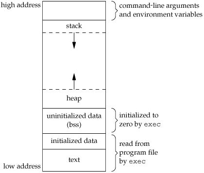

<!-- TOC -->

- [Memory Allocation in C](#memory-allocation-in-c)
  - [1. Text / Code Segment](#1-text--code-segment)
  - [2. Initialized Data Segment](#2-initialized-data-segment)
  - [3. Uninitialized Data Segment / BSS](#3-uninitialized-data-segment--bss)
  - [4. Heap](#4-heap)
  - [5. Stack](#5-stack)
    - [What are Automatic Variables?](#what-are-automatic-variables)
    - [What is Stack Overflow Error?](#what-is-stack-overflow-error)
  - [6. Command Line Arguments](#6-command-line-arguments)
  - [7. Usage of Heap](#7-usage-of-heap)
- [Source Code to Executable File](#source-code-to-executable-file)
  - [Source Code to Assembly Code](#source-code-to-assembly-code)
  - [Assembly Code to Object Code](#assembly-code-to-object-code)
    - [What is Object Code?](#what-is-object-code)
  - [`gcc` compiler](#gcc-compiler)
  - [Intermediate/Object Code files](#intermediateobject-code-files)
  - [Role of Linker in creating executable/library files](#role-of-linker-in-creating-executablelibrary-files)
    - [How exactly does `linker` work and what is its need?](#how-exactly-does-linker-work-and-what-is-its-need)
- [Sequence Points in C/C++](#sequence-points-in-cc) 
<!-- /TOC -->
# Memory Allocation in C

Memory assigned to a program in a typical architecture can be broken down into four segments:
A typical memory representation of a C program consists of the following sections.
1. Text/Code segment  (i.e. instructions)
2. Initialized data segment 
3. Uninitialized data segment  (bss)
4. Heap 
5. Stack
6. Command Line Arguments
   
A typical memory layout of a running process



## 1. Text / Code Segment 

Text / Code segment is one of the sections of a program in an object file or in memory, which contains executable instructions.

We can understand this with the help of an example:

When we compile a program a BINARY file containing **Intermediate Code** gets generated. Suppose we generate a.out for a hello world C-program. a.out consists of the instructions and these instructions are stored in the text segment. 

As a memory region, a text segment may be placed below the heap or stack in order to prevent heaps and stack overflows from overwriting it. In addition to that, it is read-only. 

Usually, the text segment is sharable so that only a single copy needs to be in memory for frequently executed programs, such as text editors, the C compiler, the shells, and so on. Also, the text segment is often read-only, to prevent a program from accidentally modifying its instructions.

## 2. Initialized Data Segment 

Initialized data segment, usually called simply the **Data Segment**. A data segment is a portion of the virtual address space of a program, which contains the global variables and static variables that are initialized by the programmer.
Note that, the data segment is not read-only, since the values of the variables can be altered at run time.
This segment can be further classified into the initialized read-only area and the initialized read-write area.

For instance, the global string defined by 
`char s[] = “hello world”` in C and a C statement like `int debug=1` outside the main (i.e. global) would be stored in the initialized read-write area. 

And a global C statement like `const char* string = “hello world”` makes the string literal `“hello world”` to be stored in the initialized read-only area and the character pointer variable string in the initialized read-write area.

Ex: `static int i = 10` will be stored in the data segment and `global int i = 10` will also be stored in data segment

## 3. Uninitialized Data Segment / BSS

Uninitialized data segment often called the `bss` segment, named after an ancient assembler operator that stood for “block started by symbol.” 

It starts at the end of the [initialized data segment](#2-initialized-data-segment).

Every member of this segment is initialized by the kernel to arithmetic 0 before the program starts executing

It contains all `global` and `static` variables that are initialized to zero or do not have EXPLICIT INTIALIZATION in source code.

For instance, 

- a variable declared `static int i`
- a global variable declared `int j`
 
both, would be contained in the BSS segment.

## 4. Heap

Heap is the segment where dynamic memory allocation usually takes place.

The heap area begins at the end of the BSS segment and grows to larger addresses from there. 

Using `malloc` and `calloc` we can allocate memory in heap.

The Heap area is shared by all shared libraries and dynamically loaded modules in a process.

Checkout the [usage of heap](#7-usage-of-heap) below.

## 5. Stack

The process Stack contains TEMPORARY data such as:

- used to store all `local variables`.
- used for passing `parameters` to the methods/functions along with storing the `return address` of the **instruction**. This instruction is returned to the appropriate `return address` after the function call is over.
- used for storing [automatic variables](#what-are-automatic-variables). 
  
    ### What are Automatic Variables??

    Automatic variables are local variables that allocate memory automatically upon entry to that block and free the occupied memory upon exit from that block.

    In C/C++, all variables declared within a block of code are `automatic` by default. An uninitialized automatic variable has an undefined value until it is assigned a valid value of its type.

It is called the **Stack** segment since it has the Last-In-First-Out (LIFO) structure.


The stack area is traditionally adjoined with the heap area and grows in the opposite direction. When the stack pointer meets the heap pointer, free memory was exhausted. (With modern large address spaces and virtual memory techniques they may be placed almost anywhere, but they still typically grow in opposite directions.)

Each time a function is called, a `stack frame` is pushed onto the stack. It is effectively, a segregated section on the stack. It consists at the least, a return address and certain information about the caller's environment. 

The newly called function then allocates room within the `stack frame` for its automatic and other local variables. 

This is the premise of the working of recursive functions in C. Each time a recursive function calls itself, a new stack frame is pushed, so that one set of variables doesn’t interfere with the variables from another instance of the function. 

As the variables are popped out of the stack frame once their scope is over, at the bottom of the stack frame is the `return address`, which is the last operation completed before the stack frame is removed because the function call ends with a return operation.

### What is Stack Overflow Error?

The compiler allocates some space for the stack part of the memory. When this space gets exhausted due to some faulty code, the situation is called **stack overflow**.
Typical example includes recursion with wrong/no base condition.

## 6. Command Line Arguments

Command line arguments like `argc` and `argv`, and environment variables are stored in this memory.

## 7. Usage of Heap

We can create a pointer in our `main` function and point to a memory block in the HEAP. 
The address is stored by the local variable in the `main` function (this local variable is stored in Stack segment in the `stack frame` of the `main` function). 

We should note that the memory consumed will not get freed automatically in case we overwrite the pointer. If suppose we overwrite the pointer to an array with a character, the remaining memory which was occupied by the array will become GARBAGE and it will be counted in the usage of the program.

This should be looked out for as it can lead to complete exhaustion of the memory.

# Source Code to Executable File

## Source Code to Assembly Code

When we have the source code of a C program, that `source code` is passed to the compiler and compiler will produce the output in `assembly code` (mnemonic version of machine code). 

## Assembly Code to Object Code

This assembly language code is given to the assembler and assembler produces `object code`,  which is usually in binary language.  

### What is Object Code?

The term `object code` indicates the code is the goal or **"objective"** of the compiling process, wherein compilation includes the assembling phases as well.

This code can be run on any machine with the same CPU architecture. It is also referred to as **Intermediate Code**.

## `gcc` compiler

When we wish to run a C program, we just pass it to the `gcc` compiler and it directly gives us the executable file for the program. 

But, we know that there are several steps along with compilation for obtaining the executable file for a program.

The compiler software actually has within it, the `assembler` along with `loader` and `linker`. So, all the modules are kept together. 

When we call `gcc`, we are actually calling not just the `compiler`, we are calling the `compiler`, then `assembler`, then `linker` and `loader`.

## Intermediate/Object Code files

`.obj` files (.o files on Linux/Unix) are `compiled & assembled` source files. There will indeed be one for each `.cpp` file, or more formally "compilation unit". 

They are produced by the `compilation & assembling` phase of building a project.
<div align="center" >

</div>

## Role of Linker in creating executable/library files

These `.obj` files are then combined by linker to:
 - an application, which is usually a `.exe` file on Windows. On Unix-like systems, an application has no extension. 
 
 OR
 - a library file (dynamic or static)
    -  `.dll` on Windows, `.so` on a Unix-like platform for dynamic library files.
    - `.lib` on Windows, `.a` on a Unix-like platform for static library files (which is basically a collection of `.obj` files in one packed into one file). 

We do not see `.obj` files or static `.lib` files with applications/programs, because they are not needed at runtime, they are used only by `linker`. 

When we run the linking phase of building a project, `linker` combines all the needed `.obj` files into `.exe` and `.dll` files (or equivalent), which are used at runtime.

### How exactly does `linker` work and what is its need?

Let us assume that we `#include`'d some header files in our C program and used the functions that had their prototypes within these header files.

We know that the actual definitions of these functions are in certain libraries that are referred to within the header file.

If we were to explain the need of a linker in simple terms, after `compilation & assembling`, once we obtain the object code contained within an `.obj` file, the linker ensures that the definitions of the `library functions` used are grouped with the object code into a single package which is the `executable file` of the program.

# Sequence Points in C/C++

In general, we can consider the sequence point as it defines any point in the execution of a computer program at which it guarantees or ensures that all the side effects of the previous evaluation of the program's code are done or successfully performed. 

However, it also ensures that none of the alterations or side effects of the subsequent evaluations is yet performed at all.

Also, according to the C++ Standard:
```
Between the previous and next sequence point, 
a scalar object shall have its stored value 
modified at most once by the evaluation of an expression.
```
which, in a sense means that we are not supposed to change a variable's value multiple times in the same expression.

Take a look at [16-sequence-points.c](./16-sequence-points.c) for example code.
